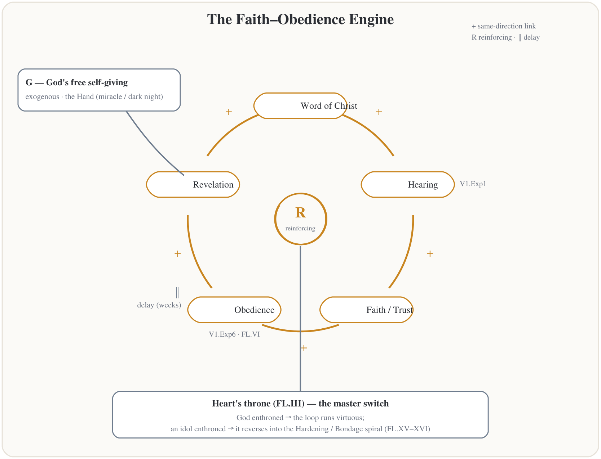
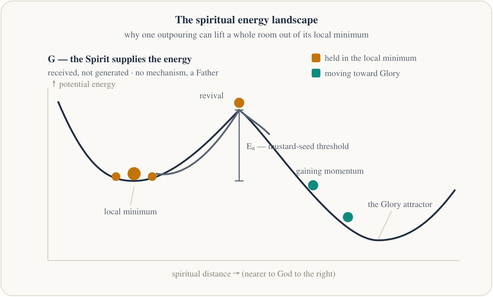
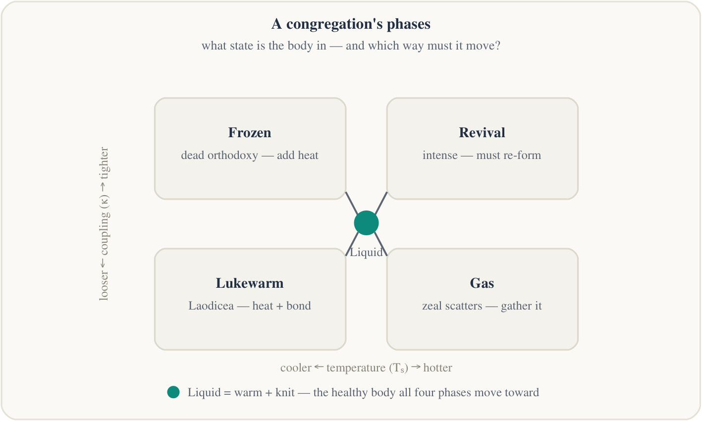
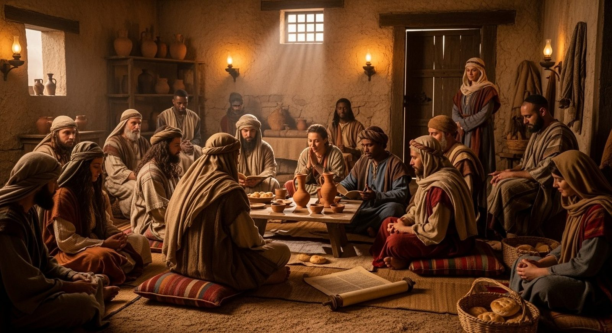
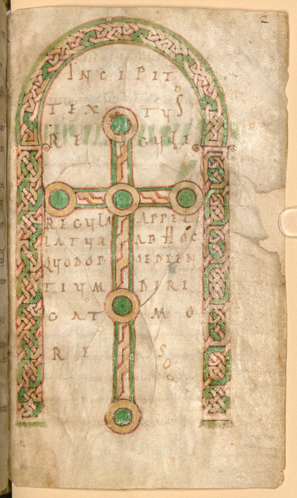
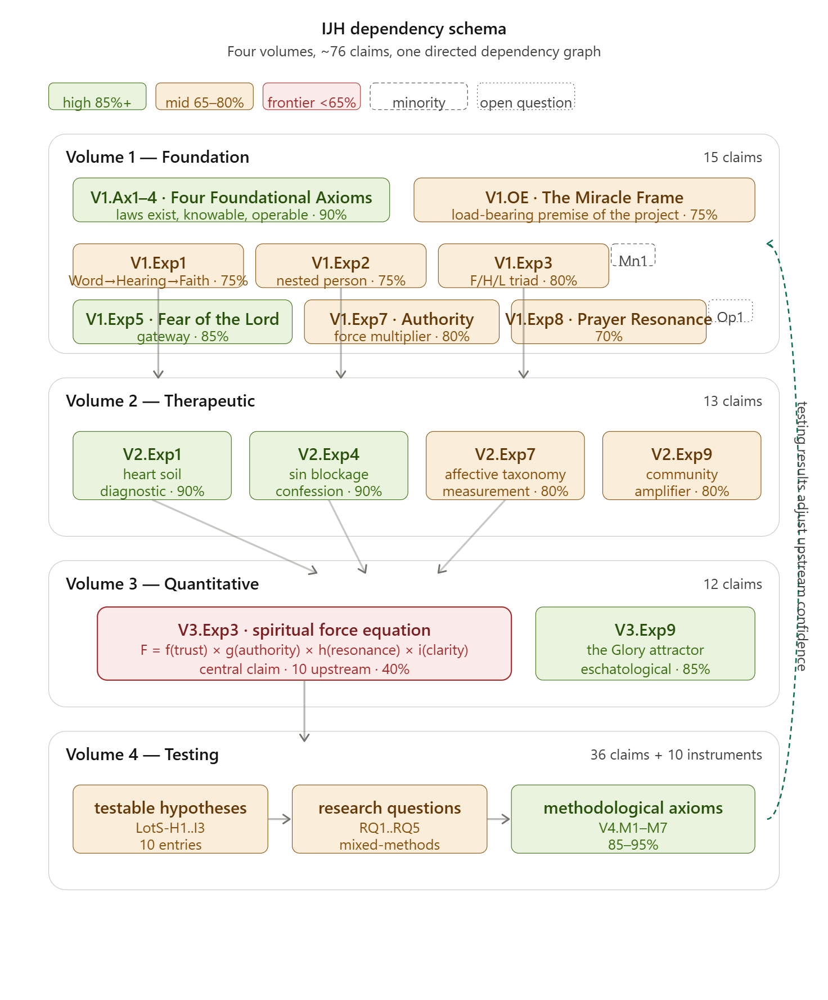

> **DRAFT v1, for John's edits.** Written to be handed to an elder or pastor who is being asked to serve as a spiritual covering for this work. Nothing here is new teaching; every sitting points back to the published volumes at [jgtittle-ministries.github.io/Intentional-Journey-of-the-Heart](https://jgtittle-ministries.github.io/Intentional-Journey-of-the-Heart/). Images are the volumes' own.

{width=65%}

# Before we begin: how to use this briefing

I have been asked, more than once and by people I respect, a fair question: *what exactly is this thing, and what would it mean to stand behind it?* This briefing is my attempt to answer that question the way I would want it answered if I were the one being asked to cover someone else's work: slowly, honestly, in a room with a table and coffee, with time to push back.

It is built the way a Fellowship of the Heart series is built, because that is the only way I know to hand this on. Eight sittings of about seventy-five minutes. Each sitting takes one volume (the first and the last take the whole), and each one runs the same way:

- **A picture** to hold while we talk, drawn from the volumes themselves.
- **An open question first**, before any teaching, because the room's honest answer is worth more than my outline.
- **A short teaching**: what this volume is, what it claims, what it is *not*, and how sure I am.
- **Discussion**, which gets the most time.
- **The covering's questions**: the things I would want to know if I were vouching for this. I try to answer them straight, including where the answer is "not yet."
- **A take-home**: one or two short chapters to read before the next sitting. Never more than twenty pages.

You do not have to read all six volumes to do this. You do have to be willing to ask hard questions and to say "wait" or "no" if that is where you land. A covering that cannot say no is not a covering.

**What I am asking, in one paragraph.** Everything in this work, and every small group that tested it, has been under the spiritual authority of my local church and my pastor. As the work has grown, it now needs that covering named more deliberately, in three places: over me as the steward of the written record; over any fellowship that runs the pattern in my home; and as the answer to a question the governance volume leaves openly unanswered, namely *to whom is the whole body answerable?* The last sitting spells that out. You will have seven sittings to decide whether you want to hear it.

---

# Sitting 1 — The whole country: what this is, and what a covering is

**Aim.** By the end of this sitting you can say in five sentences what the Intentional Journey of the Heart is, and in one sentence what is being asked of you.

**Scripture anchor.** John 3:8–10. *"Are you the teacher of Israel, and yet you do not understand these things?"*

**Open with (5 minutes).** *When you hear the phrase "laws of the Spirit," what is the first thing you feel? Not think; feel.*

## The picture

{width=85%}

## Teaching (20 minutes)

**Where it came from.** I came to the Lord on June 14, 1982. Carolyn was already a believer. Truro Church in Fairfax, John Howe's teaching, and a small-group Bible study formed us, and small groups have been the center of my walk ever since, through every Air Force move. In 2002 three men and a systems-dynamics tool started meeting in my living room on Saturday mornings to ask one question: *what would it actually look like to live the life Jesus described, the full version, with hearing God clearly and His hand at work as an ordinary thing?* Twenty-plus years of journals, men's work, inner healing, and a Band of Brothers later, this is the written record. I wrote it for my kids and grandkids first. It turned out other people wanted to read it.

**The one thread.** Hear His voice, and obey it. Hearing grows faith (Romans 10:17); without faith we cannot please Him (Hebrews 11:6); and every act of obedience opens the ear a little wider. That loop is the engine in the middle of the map. Everything else in six volumes is a closer look at some part of that country.

**The whole work in five sentences.** These are on the map, and they are enough to live on:

1. This is a map of how your heart grows toward God.
2. Everything on it slopes toward one Home: becoming like Jesus.
3. At the center is an engine: you hear God, you trust Him, you obey, and obeying opens you to hear more.
4. Some places are pits, a hardened heart, a sin you are stuck in, and you cannot climb out alone.
5. The most important thing is not machinery at all. Grace falls from *outside* the map, because God is not a system you operate. He is a Father who freely gives.

**The six volumes in six lines.**

{width=85%}

- **Volume 1, Laws of the Spirit.** The laws themselves, forty-eight of them, each with scripture and my honest certainty rating.
- **Volume 2, Knowing to Doing.** The heart work: why most of us cannot operate in those laws most of the time, and what clears the channel.
- **Volume 3, Spiritual Dynamics.** The frontier: can any of this be stated precisely, even as equations? Held loosely and labeled as such.
- **Volume 4, Testing.** How we would know if any of it is true. Instruments, protocols, a research design.
- **Volume 5, References.** The giants whose shoulders I stood on, the formation papers, and the protocols themselves.
- **Volume 6, Governance.** How the record stays honest after I am gone.

**What this is *not*.** The difference matters, so I say it early and often. It is **not a systematic theology**; for that I point you to Grudem. It is **not a denominational program**; I write from Reformed, Evangelical, Charismatic, and contemplative streams and belong to none of them. It is **not finished**, and never will be. And it is **not an apologetic**. It is a father's testimony to his family, kept true and pastorally safe. It was never built to win an argument.

**My posture, which I ask you to hold me to.** I am not asking anyone to accept any of this on my authority. I am asking them to test it: in their own life, in their own small group, with their own pastor. Where I am sure, I say so. Where I am guessing, I say that too. Every major claim carries one of three tiers: **Clearly Taught** (taught directly by scripture or directly confirmed by community testing), **Reasonably Inferred** (inferred from scripture, still needing community testing), or **Speculative** (interesting enough to pursue, not solid enough to build on). Behind the tiers is a fourfold standard for anything I call a law: it lines up with scripture; the Spirit of Truth witnesses to it; a community of practitioners recognizes it, at least in part; and it is testable in the natural, producing observable fruit in people who live by it.

## What a covering is

{width=65%}

In this work the unit of trust is not a credential. It is a covering: **a named person or body, close enough to see a life, who says so, and keeps saying so only as long as they can see it.** No one licenses a Formation Companion and no one ever will from here. Hands are laid on locally, the way Timothy was told to lay them (1 Timothy 5:22), by people near enough to know the household, the reputation, the years. The same nearness that grants standing can withdraw it, quietly and restoratively where possible. That is not a weakness in the design. It is the design.

That is what I am asking you to consider being, for me and for this work. Not a board. Not an endorser of every sentence. A covering.

## Discussion (30 minutes)

1. Read the five sentences aloud, one person each. Which one do you already believe? Which one would you want to argue with?
2. Where have you watched the engine run in someone's life: hearing, trusting, obeying, hearing more? Where have you watched it stall?
3. The map says some pits need help from outside. What does your congregation actually do for a person in a pit?

## The covering's questions (10 minutes)

- *Who has covered this work until now?* My local church and my pastor, for every small group I have run. This briefing exists because the work has outgrown an unspoken arrangement.
- *What would you do if we said no?* Say thank you and mean it. A no from people who took the time is worth more than a yes from people who did not read it.
- *Do we have to agree with all of it?* No. The tiers exist so that you do not have to. What I need is a body that can tell me when something is off, and that I have promised to listen to.

**Take-home.** *Read Me First* (two pages) and *How to Read This Book: The Country of the Heart* (four pages). Both are at the front of the site.

---

# Sitting 2 — Volume 1: Laws of the Spirit

**Aim.** Understand what I mean by a "law of the Spirit," why I think Scripture teaches that such laws exist, and where the guard against mechanism sits.

**Scripture anchor.** Galatians 6:7–8, *"whatever one sows, that will he also reap,"* read alongside John 3:8, *"the wind blows where it wishes."*

**Open with.** *Name one thing you have watched happen the same way, over and over, in people's walks with God. Something you could almost set your watch by.*

## The pictures

{width=48%}

{width=48%}

## Teaching

**The claim.** The spiritual world operates according to knowable, regular, orderly laws. Not laws that bind God (the wind still blows where it wishes; mercy is His to give as He wills, Romans 9:15–16), but laws that describe how a free God *characteristically* works, the way the laws of nature describe how His creation characteristically runs. Jesus' rebuke of Nicodemus implies exactly this: a teacher of Israel *should have understood* how things work in the Spirit. If he should have, then we, with the full canon and the indwelling Spirit, can see more than we usually do.

**Two kinds of law.** I discovered along the way that I had been working on two different things. **Structural laws** describe what exists and how it is arranged: the relationship of spirit, heart, soul, and body; faith, hope, and love as a cluster. They are like the map's terrain. **Operational laws** describe cause and process: Word → Hearing → Faith (Romans 10:17); sow this, reap that. They are like the currents. Both matter, and they are investigated differently.

**What the volume contains.** Forty-eight Foundational Laws, thirty-eight of them with wide consent across the traditions and ten newer ones still being tested by the community. Each carries scripture, a plain statement, and a tier. Then eight Explorations, the working investigations: how to get faith; my spirit, heart, soul, and body; faith, hope, and love; wisdom, knowledge, understanding, and discernment; the fear of the Lord as the gateway condition; the obedience channel through which revelation flows; spiritual authority as a force multiplier; prayer as a resonance phenomenon. At the front sits a chapter I put there on purpose, *What We Are Being Formed For*: the kingdom is present-tense, and the laws are the **Means** in Dallas Willard's Vision–Intention–Means, useless without the other two.

{width=48%}

**A few laws, so you can hear the shape.**

- *Sowing and Reaping* (FL.I). What is planted is what grows, in kind and in season. Galatians 6.
- *Confession and Restoration* (FL.II). Confessed sin opens the way back. 1 John 1:9.
- *The Heart Throne* (FL.III). Whatever sits at the center of the heart governs the whole of it. This is the master switch of the engine.
- *Humility and Exaltation* (FL.IV). James 4:10.
- *Hear and Obey* (FL.VI). The engine itself.
- *Hardening* (FL.XV). A heart that stops responding slowly stops being able to. Hebrews 3. This is a pit.

{width=65%}

**The Periodic Table.** With forty-eight laws it helps to have an organizing picture. Volume 5 lays them out on a table with two axes, the way chemistry's periodic table arranges elements, so that gaps become visible and undiscovered laws can be predicted. It is a way of seeing, not another set of claims.

{width=80%}

**How sure I am.** The four foundational axioms (laws exist, are knowable, are operable, and describe a free God) sit at the top of my scale. The fear of the Lord as gateway, the obedience channel, and the eschatological glory that the whole map leans toward are anchors. Most of the forty-eight are Reasonably Inferred. Prayer as resonance is lower. I would rather you see the spread than pretend it is flat.

**What it is *not*.** It is not a formula. Every good road on the map has a shadow road: drawing near or hardening, worship or idolatry, one path in two directions. And the rule that governs the whole country is written at the top of the map in large letters: *grace comes from outside.* There is no mechanism. There is a Father.

## Discussion

1. Pick one of the six laws above. Tell a story from your own congregation where you watched it operate. Did the "law" language help you see it, or get in the way?
2. Where does calling something a "law" worry you? Say it plainly. That worry is the most useful thing you can give me.
3. The volume says these laws are knowable in spirit, mind, and body, and that knowing them only in the head is not knowing them. Do you agree?

## The covering's questions

- *Does anything here contradict what our church teaches?* Walk the forty-eight with me on your own time and tell me. Thirty-eight of them are, as far as I can find, common ground across the streams. The ten newer ones are marked as such.
- *Where is the guard against turning God into a vending machine?* In three places: the top of the map (grace from outside), the shadow-road rule, and the tiers. If you ever hear me or anyone teaching a law as a lever, that is exactly the moment a covering exists for.
- *Who decided the certainty ratings?* I did, by counting independent scriptural lines, weighting direct statements over inferences over analogies, and flagging where my own reading is doing the work. They are signals, not measurements. Volume 6 exists so that they stop being only mine.

**Take-home.** *Foundational Law VI: The Hear-and-Obey Law* and *Foundational Law XV: The Hardening Law*. About six pages together.

---

# Sitting 3 — Volume 2: Knowing to Doing

**Aim.** See why a true law can be inoperative in a real life, what blocks the channel, and what clears it. Meet the safeguards, because this is where real people get touched.

**Scripture anchor.** Mark 4:3–20, the soils. Psalm 51:6, *"you delight in truth in the inward being."*

**Open with.** *Tell about a season when you knew something was true and could not live in it. What was in the way?*

## The pictures

{width=65%}

{width=60%}

## Teaching

**The premise, in my own words.** The laws in Volume 1 are operational for a person whose channel is open, whose heart soil is in good condition, and whose community is working as designed. Most of us, most of the time, are not in that state. Not because we are bad believers, but because life does damage, the damage accumulates, and unaddressed damage blocks hearing as surely as a clog blocks a pipe. I have lived through long stretches where the laws were true and my experience did not match. Volume 2 is about getting the pipe clear and keeping it that way.

**The Story it sits inside.** Before any tool, the volume puts the participant inside the one Story: creation, fall, redemption, consummation. The person doing this work is not first a patient. They are a character in that Story, and every wound that can be healed and every lie that can be broken is possible because of what happened on a particular Friday. *This work is downstream of the cross.* Eldredge presses one more thing, which the volume tests rather than assumes: the enemy actively works to keep wounds unhealed, because a believer who cannot hear is a believer who cannot act. Clearing a knot is also reclaiming ground.

**Three parts.**

*Diagnostic.* What blocks hearing? The **Heart Soil** diagnostic, straight from Mark 4, with Paul's own mixed ground as proof that honest hearts hold all four soils at once. The distinction between **wound and sin**, the kintsugi bowl and the ink stain, which call for different responses and are disastrous when confused. **Emotional knots** (the energetic blockage), **the false self** (the identity blockage), **believing a lie** (the cognitive blockage), and **standing interior agreements**, the vows a person made long ago that still operate whether or not they remember signing.

*Therapeutic.* What clears it? **Confession and restoration**, which clears the sin blockage and is the anchor claim of the whole corpus. Forgiveness as re-integration of the one who wronged you. And the **Tool Map**: the discipline of matching the right tool to the right blockage, because a confession tool applied to a wound wounds again, and a healing tool applied to unconfessed sin excuses it.

{width=48%}

*Developmental.* What keeps it clear? **Hearing with understanding**, which is where the small-group practice called PROAPT lives (Pray, Read, Observe, Apply, Pray, Tell). **The container**: the conditions a community prepares so that hearing can happen safely. **Community as amplifier**, with its law and its danger in the same chapter. And a **training plan**, because operating in faith is a learnable skill.

{width=48%}

**The Four Connects.** One chapter you will meet again in Fellowship of the Heart: connecting with **Self**, with **Others**, with **God**, and with **Mission**, in that order, because the order is causal. You cannot connect with others until you are honest with yourself. You cannot connect with God beyond performance until you are honest with yourself and at least one person knows your interior life. You cannot find your mission until the first three are real.

{width=65%}

**Where the tools came from.** I did not invent them. Leanne Payne and Rita Bennett in inner healing, the Grief Recovery work, Transformation Prayer Ministry, Wild at Heart, and years of Band of Brothers work with men. Some tools came from secular workshops. I told my pastor after one of them that the church desperately needed these tools for heart work and that Satan does not get to keep them. Exploration 0 of this volume is the **tool import discipline**: every tool is brought under the Christian frame and screened scripturally, and the ungrounded metaphysics behind some of them is discarded. What I claim as my own contribution is the connection between the tools and the laws.

**A debt I name here.** Dave Smith and I walked much of this experiential work together over many years as a Band of Brothers. His book, *Relational Discipleship: Transformation Through a Band of Brothers*, documents some of the processes. He is also the person the governance volume names to carry the theological shape of the work if I cannot.

**How sure I am.** The Heart Soil diagnostic and the sin-blockage law are as sure as anything in the corpus: explicit scripture, millennia of consistent tradition, direct experience. The Tool Map is lower, and it is the claim I most want tested, because it is the most consequential for pastoral use.

**What it is *not*.** It is not therapy and it does not replace pastoral care or clinical care. A Formation Companion is not a counselor. The volume says so, and the pilot materials carry a referral list and a named pastor as the door out.

## Discussion

1. Wound or sin: where has your congregation confused the two, and what did it cost?
2. The Four Connects say you cannot connect with God beyond performance until one person knows your interior life. Is that true in your experience? Who knows yours?
3. Which of the tools named here would you want to see run before you trusted it?

## The covering's questions

- *Who is at risk here, and what protects them?* People who open their interior life in a room. What protects them: consent and the right to stop, named in writing; the **never-one-on-one rule** (a second person is always present, an adult where the person is a minor); the container discipline; a referral list with a pastor named as the door out; and a vetted shelf of outside resources. All of that is written into the Fellowship of the Heart handbooks and was strengthened this summer.
- *Are secular tools load-bearing?* No. They are imported under the tool-import discipline and stand only where scripture and the community's testing hold them up. Where they cannot be grounded, they are dropped.
- *What happens when someone gets worse, not better?* The volume names the after-writing dip and the hard night, and the materials give people a page for it. Beyond that, the door out is a real pastor with a real phone number.

**Take-home.** *First Exploration: The Heart Soil* and *Fourth Exploration: Confession and Restoration*. About twelve pages together.

---

# Sitting 4 — Volume 3: Spiritual Dynamics

**Aim.** Understand what the quantitative volume is trying to do, why it troubles some readers, and why it is held at the lowest confidence in the corpus and built on by nothing.

**Scripture anchor.** John 3:8. Proverbs 25:2, *"It is the glory of God to conceal things, but the glory of kings is to search things out."*

**Open with.** *When someone asks "how could you tell?" about a spiritual claim, does that feel like honesty or like trespass?*

## The pictures

{width=65%}

{width=65%}

## Teaching

**The question and my answer.** If the spiritual world runs by knowable laws, can those laws be stated not just qualitatively but precisely? Can we name elemental quantities, write relationships as equations, find conservation laws, model feedback? My answer: *probably yes, partially, and not yet.* Probably yes, because the God who made a universe precise enough for Maxwell's equations does not seem the kind of God who would make a spiritual world of vague forces. Partially, because the volume is genuinely preliminary. Not yet, because the measurement problem is real and I do not have a solution I am satisfied with.

**Why I keep asking the metric question.** I have taken my share of pushback on this track, and I understand it; to some ears it sounds like putting God under a microscope. But in forty years of work I have found that asking *how would you actually know?* clears fog faster than anything else I know. In my consulting life I had to measure things as slippery as trust between a customer and a team, and I got there by asking the customer plainly: *how could you tell that you trusted us?* The answers were solid enough to write into a contract under which real money changed hands every month. If the metric question can do that for trust, I think it is worth asking of the life of the Spirit. Whether the answers ever come out clean, I leave to God and to people more competent than I.

**The one distinction that governs the volume.** An analogy is **illustrative** when it helps you see the shape of a spiritual relationship by pointing at a physical one. It is **load-bearing** when I claim the spiritual law has the same mathematical form and can yield predictions. *Most of the analogies here are illustrative.* The handful I propose as stronger are flagged, and Volume 6 requires a formal vote before any analogy is ever promoted from one class to the other, because analogies drift upward silently if no one is watching.

{width=85%}

**What is in it.** The case for quantification. A borrowed framework called Transcendental Field Theory, which uses the language of quantum field theory as a *structural analogy* for how truth, goodness, beauty, life, light, love, glory, and the rest relate; I make no claim to understand quantum field theory and say so in print. Spiritual force, distance, energy, and power. Conservation laws, which I call the hardest question in the volume. Systems dynamics as the modeling language, which is where the loop diagrams come from and where the Saturday morning group began. Miracles as resonance points. And the Glory attractor: the pull toward Home that shapes the whole sanctification trajectory.

{width=85%}

**The one equation people ask about.** The volume proposes a form for spiritual force. After a nine-author review it now leads with a term for God's free self-giving that is *not operable* by anyone; the four factors inside the brackets (trust, authority, resonance, clarity) are conditions of reception, not causes of production. It sits at the Speculative tier. That rating does not mean "probably wrong." It means the structure may be right and the specific form is genuinely open. *Do not build on this formulation yet.* Nobody does.

{width=85%}

**How sure I am.** This is the frontier, and the ratings say so: the force equation and the conservation laws are the two lowest-confidence claims in the entire corpus, and miracles-as-threshold-events is not far above them. The Glory attractor is the exception; it is an anchor, because it is eschatology, not physics. The volume's *Open Trails* chapter lists what it cannot yet answer.

**What it is *not*.** It is not doctrine and is not taught as such anywhere. It is not a claim that physics applies to God. It is one man's honest attempt at precision, published with its uncertainty printed on it, waiting for a scripturally grounded physicist to either carry it further or bury it well.

## Discussion

1. Is the metric question a help or a trespass? Make the strongest case for the side you did *not* choose.
2. Look at the engine diagram. Where does it match your pastoral experience? Where does the real thing refuse to be drawn?
3. Volume 6 will not let any analogy become "load-bearing" without a formal decision. Is that enough of a guard?

## The covering's questions

- *Is any of this taught in the Fellowship of the Heart rooms?* No. The pilot materials draw on the loop diagrams for the leaders' understanding of dynamics, and nothing at the Speculative tier is taught to participants.
- *What stops this from becoming the tail that wags the dog?* The tiers, the analogy-class rule, and the governance rule that frontier claims move only on evidence, never on a well-argued proposal.
- *Would you be sad if it turned out to be wrong?* A little. I would be much sadder if I had pretended it was settled.

**Take-home.** *A Note Before We Begin: What This Volume Is and Is Not*. Five pages, and honestly the only part of Volume 3 a covering needs.

---

# Sitting 5 — Volume 4: Testing

**Aim.** Understand how the work proposes to find out whether it is true, what it refuses to measure, and what "earning the right to ask" means before anyone hands a person a questionnaire.

**Scripture anchor.** 1 Thessalonians 5:21, *"test everything; hold fast what is good."* Luke 8:15, fruit *"with patience."*

**Open with.** *What would you accept as evidence that a person's heart had actually changed? Not their words. Evidence.*

## The pictures

{width=65%}

{width=65%}

## Teaching

**Why test at all.** Volumes 1 through 3 make claims. Volume 4 asks the next honest question: *how would we know?* It names three kinds of testing (personal, communal, and formal academic), four sources of knowledge (scripture, reason, experience, community), and it treats the Holy Spirit as a methodological problem honestly rather than pretending He can be controlled for. The whole volume depends on the earlier ones and says so; if they change, it must change.

**The one model everything measures against.** The **Affective Taxonomy**, a five-level developmental frame from educational psychology (Krathwohl, Bloom, and Masia, 1964, developed for spiritual formation by Bramer): Receiving, Responding, Valuing, Organization, Characterization. Trust in scripture is the test case. Two things the volume insists on. First, the levels are **integration, not replacement**: a person at the fifth level whose first-level receiving has died is not mature, they are rigid, and the Pharisee is the worked example of a collapse at level two masquerading as level five. Second, progress is **a spiral, not a staircase**; apparent regression under suffering is disorientation, not a lost level.

**The practice it observes.** PROAPT: Pray, Read, Observe, Apply, Pray, Tell. A reflective Bible study with a "tell somebody" step at the end. The Willow Creek MOVE study found reflective Bible study to be the one discipline present at every stage of growth; this volume makes it the practice the entire program watches. The simplest group measure in the book is the **Tell-Rate**: what fraction of the room completed the Tell step this week. That is Romans 10 operating at the group level.

**What gets measured.** A small **Pilot Ready core**, chosen so that a real facilitator in a real church can run it without the measuring competing with their presence in the room: a stage profile a person fills out on themselves; a monthly first-person reflection; an interview with someone outside the group who knows them (a spouse, a friend, a coworker) at the start and at twelve months; the same profile for the group's culture; the weekly Tell-Rate; and the facilitator's own profile as a variable in the group's outcome. Eight heavier research instruments are kept in an appendix for studies that want them and can bear the load.

**Before you measure.** A chapter I added this summer, *Earning the Right to Ask*, is the part I would most want a covering to read. It lays out a validation ladder that every instrument must climb before it is used on real people, and it names the ordering rule I call the weep-test: no measure runs in a room where the people measuring cannot weep with the people measured. The fields that borrowed the Affective Taxonomy before us learned that the hard way.

**Where it is being tested.** The Fellowship of the Heart pilot is the live test bed. Its standing instruments are deliberately light: three vital signs, a journal, quarterly pulses, and pre- and post-series surveys. The richer instruments stay on the diagnostic shelf until the ladder has been climbed.

**How sure I am.** The methodological axioms, including disconfirmability (every claim must say what would count against it), are the most confident claims in the whole corpus. Every testable hypothesis inherits its confidence from the Volume 1 or 2 claim it tests. The data does not exist yet. That is the honest state.

**What it is *not*.** It is not a program for grading people's spirituality, and it forbids being used as one. The claim ceilings are printed. No one is ever told their level.

## Discussion

1. Integration, not replacement. Where have you seen a mature-looking believer who had lost the ability to receive? What did it look like from the pew?
2. The Tell-Rate: what fraction of your own small group tells someone what they heard, each week? Would you want to know?
3. The weep-test. Is there a measure your church already uses that could not pass it?

## The covering's questions

- *Who consents, and who sees the data?* Consent is written and revocable. Minors require a parent's consent and are never interviewed alone. Aggregates go to the Council; individuals see only their own. Nothing identifiable is published.
- *Could this be used to exclude someone from leadership?* The instruments are forbidden that use in writing. Volume 5 says the Companion levels are safety floors, not ranks, and no one issues them.
- *When does the first real data arrive?* When a cohort runs a full year. As of this writing, the first cohort has not yet formed. I would rather tell you that than hint otherwise.

**Take-home.** *Section 1: Why Testing Matters* and *Before You Measure: Earning the Right to Ask*. About ten pages.

---

# Sitting 6 — Volume 5: References and the Formation Documents

**Aim.** Meet the giants, the papers, and the protocols, so that you know whose voices are in the room and can tell me whose are missing.

**Scripture anchor.** Hebrews 12:1, *"so great a cloud of witnesses."* 2 Timothy 2:2, entrusted to the faithful, who entrust it again.

**Open with.** *Who taught you to walk with God? Name two people and one book.*

## The pictures

{width=85%}

{width=65%}

## Teaching

**What the volume is.** Three things under one cover. First, an **annotated bibliography**, every source in five categories with a full citation and a structured note on what I took from it. Second, the **Formation Documents**, the companion papers I wrote as the formal side of the same exploration. Third, the **protocols**: the actual small-group processes, numbered and written so that any household can run them.

**The giants.** John Howe, who taught me the basics and told me to keep a journal. Leanne Payne, Richard Foster, Derek Prince. Dallas Willard, whose Vision, Intention, and Means frames Volume 1. John Eldredge, whose *Wild at Heart* first showed me Christian process work and gave me the Band of Brothers language. C. S. Lewis, for the true myth and the map of the Atlantic. Wayne Grudem, whose qualitative confidence structure I adopted for the tiers. And a Saturday morning group of men, Tom, Larry, and the others, who tested the early laws with me when they were only half-formed. Newton said it: if I have seen further, it is by standing on the shoulders of giants.

**The Formation Documents.** The **Theological Anthropology** paper is foundational: what scripture means by heart, spirit, soul, and mind, and the argument that each is distinct and trainable. The **Heart Formation Theology** paper applies the Affective Taxonomy to the heart with trust in scripture as the test case. The **Soul and Spirit Taxonomies** paper proposes parallel five-stage maps for soul and spirit. The **Model of Spiritual Formation for Individuals and Small Groups** is the most comprehensive, integrating all three with Old and New Testament formation theology and mapping the taxonomy onto the Parable of the Sower. The **Formation Companion** paper describes the person who facilitates this in others as a synthesis of four established Christian spiritual care traditions, with three developmental levels and a capstone skill of switching modes in real time. Then the **Four Connects**, **Measuring Spiritual Formation at Scale**, **Attachment Theory and the Biblical Triad**, and a four-part series on hearing God. These papers run alongside the volumes. The volumes ask how the laws work; the papers ask what it looks like from the inside to be formed by them.

**The protocols.** These are the hands-on part: Heart Bible Study with PROAPT, Tell Your Story, the Any Doubts process, Hot Seat, What's at Risk, Blessing Receiving, Breaking the Contracts, Heart Prayer Time, the Group Mission of Service, and the mission arc. Each one has a written recipe, a facilitator structure, and a note on which blockage it is for. Everything a Fellowship of the Heart runs is here.

**The Formation Companion, one more time.** The role used to be called the Weapons Master, a term from the men's-work world that did not survive the move to mixed-gender work. The role did: one who facilitates, bridges, escorts, accompanies, and intercedes; who leads from behind, offering the next question and letting the pilgrim choose the step; who listens at once to the person, to the Spirit, and to the body. The levels are safety floors, not ranks. The character prerequisites (1 Timothy 3, Titus 1) are deliberately left for the Council to complete, and I have asked for a woman theologian's help to do it, because the volume is more male in its experience than I would like.

**How sure I am.** This volume makes few claims of its own; it mostly tells you where mine came from. Where the sources disagree with each other, the annotation says so.

**What it is *not*.** It is not an endorsement of everything every author wrote. Some sources are secular, and the tool-import discipline governs them.

## Discussion

1. Whose voices do you recognize on the list? Whose do you trust? Whose would make you uneasy, and why?
2. Who is missing? The panel that reviewed the work named the gaps openly: a woman theologian, an Orthodox or patristic voice, a Roman Catholic sacramental voice, a majority-world voice, an analytic philosopher. Add your own.
3. Read the Formation Companion's short description aloud. Who in your congregation already is one, whether or not they have the name?

## The covering's questions

- *Which sources would our church be uncomfortable with, and are they load-bearing?* Bring me the list. My expectation is that the uncomfortable ones are the secular process tools, and none of those is load-bearing; the laws stand on scripture and the tradition, and the tools are screened.
- *Does the Companion role compete with the pastor?* No, and the Formation Companion paper says the pastor is the door out, not a rival. A Companion who cannot name their covering is not ready.
- *How does someone become a Companion here?* By receiving every practice before leading one, by leading with a seasoned Companion in the room, under a covering that watches. There is no certificate and there never will be.

**Take-home.** *The Key to Acronyms and Abbreviations* (keep it beside you for the rest of the sittings) and *The Formation Companion* summary. About eight pages.

---

# Sitting 7 — Volume 6: Governance

**Aim.** Understand how the written record is meant to stay honest after me, what the Council is and is not, and where the one unanswered question sits, because it is the question you are being asked to answer.

**Scripture anchor.** Acts 15:28, *"it has seemed good to the Holy Spirit and to us."* Hebrews 13:17.

**Open with.** *What do you want to happen to the things you have written or built when you are gone? Who would you trust with them, and why?*

## The pictures

{width=65%}

{width=48%}

## Teaching

**Why the volume exists.** I wrote it because my runway was getting shorter. Volumes 1 through 5 are my personal record of what I believe the Lord has shown me. Volume 6 is the framework under which that record is stewarded, refined, and, where necessary, corrected by others. I wrote it in a more institutional voice on purpose. It is meant to outlast me.

**The Council is a fellowship, not a board.** This is the heart of the volume and the part I care most about. The Council of Stewards is a small group of believers walking the Four Connects together, doing their own formation work on the same material they steward. Its first job is its own formation. Its second job, which flows from the first, is stewardship of the work. It meets the way a Fellowship of the Heart meets: with time to be together, governance done inside the formation, votes rare and never used to end a disagreement that has not been prayed through. It has a short Rule of Life, read aloud at every gathering, and it holds itself loosely: *the Council is not the Work.* If the work matures past needing it, it releases itself without bitterness.

**Preserved dissent.** When a claim is revised, the prior position is kept with its argument, not deleted. When the Council declines a change someone cared about, the argument is kept. Minority positions and open questions are first-class content. This is what makes the record a living tradition rather than a series of overwrites, and it is the discipline I would most like to see kept after me.

**The map of the claims.** Every substantive claim in Volumes 1 through 4 has an entry with its confidence, its scriptures, what it depends on, what depends on it, and what would count against it. The picture below is the overview. It exists so that a Council member can see, before touching one claim, what else moves.

{width=85%}

**The governance itself, in this season.** The first draft of the governance model was written for a project with many hands: outside contributors, contested claims, comment periods, supermajorities. That project has not arrived, and I am bringing the Council a lighter rule for a quiet season: I steward the record and make the changes; once a month the Council hears what I have changed and what I intend to change, and it blesses, questions, or asks me to wait. Three kinds of change get three kinds of ask. Small refinements I simply *tell*. Anything touching the foundations, the anchor claims, safeguarding, or the rule itself I *ask* before publishing. Frontier claims *wait* for evidence. The repository keeps the full history of every change with its reason, and a short public log records each meeting, including any dissent by name. The heavier rule stays on the shelf with a trigger to bring it back.

**Succession.** The volume ends with a letter naming two people if I cannot continue: a Literary Executor with administrative custody (my son, John David) and a Theological Successor who chairs the Council and carries the theological shape of the work (Dave Smith). The letter is signed before the Council as witnesses on 6 September 2026.

**The unanswered question.** The Council paper says plainly that the Council is answerable first to Christ, second to scripture as the norming norm, third to the community it serves, and that it is *under a spiritual authority that has yet to be identified and must be clarified before initiation.* The governance model repeats it: the whole body, founder, Council, and contributors, needs a broad-brush spiritual authority it answers to, and the internal ordering does not foreclose that. I have left that question open in print for a year because it is not mine to answer alone. It is the subject of the last sitting.

**How sure I am.** The Council-as-fellowship paper is held at moderate confidence as a first pass, and it invites the first Council to change it. The claim map is solid as a map. The lighter rule is a draft.

**What it is *not*.** The Council stewards *pages*, never *persons*. It is not a licensing body, a credentialing office, or a court. It cannot compel me, and I cannot compel it. It can tell me to wait, and I have promised to.

## Discussion

1. "Governance is formation." Does that ring true, or does it sound like a way to avoid hard decisions?
2. Preserved dissent. Name a decision in your own church where the minority's argument was kept, and one where it was erased. What happened afterward?
3. Read the Rule of Life aloud, one line each. Which line would your leadership team most need?

## The covering's questions

- *What exactly would we be answerable for?* Not the content of every claim. For the *life* of the steward and the Council: that they remain under authority, that the safeguards hold, that the record stays honest, and that the work does not become something it said it would not be.
- *How do we say stop?* Directly, to me, and in writing if it needs to be in the log. The light rule gives the Council a real "wait," and it gives a covering the same.
- *What if the Council and the covering disagree?* Then the work waits and the disagreement is written down. Nothing in this design allows an end run around a covering.

**Take-home.** The *Foreword* to the Council paper and the *Rule of Life* at its end. About six pages. If you want the mechanics, the light-rule draft is four more.

---

# Sitting 8 — The ask, and the answer

**Aim.** Say plainly what I am asking, what I am not, and how a yes, a not-yet, or a no would each be received.

**Scripture anchor.** Acts 18:24–28, Apollos, Priscilla, Aquila, and the letter the brothers wrote. 2 Corinthians 3:2, *"you yourselves are our letter."*

**Open with.** *After seven sittings: what would you need to know, or see, before you could put your name to this?*

## The pictures

{width=65%}

{width=65%}

## What I am asking

Three things, and I would rather you take one than feel you must take all three.

1. **To be the named covering over me as steward of this work.** Concretely: to know what I am doing with it, to receive the monthly changes note or the Council's log if you want it, and to hold the right to say *wait* or *stop*, which I have promised in print to honor.
2. **To be the named covering over any fellowship that runs this pattern in my home.** The Fellowship of the Heart materials say no group runs uncovered, that a second adult is always present, and that a named pastor is the door out for anyone who needs more than a small group can give. For a group in my house, that door needs to be a real person with a real phone number, and that person cannot be me.
3. **To be, or to help identify, the answer to Volume 6's open question**: the spiritual authority to which the whole body, founder and Council together, is answerable. This may be you, or your elders, or someone you point me to. I am asking you to help me get it right, not to volunteer by default.

## What I am not asking

- To endorse every claim. The tiers exist so that you do not have to.
- To read all six volumes. The take-homes in this briefing are enough to cover it honestly.
- To be a board. The Council stewards the pages. A covering watches a life.
- To carry it alone. Two names are better than one, and the pattern says so.

## How a covering withdraws

The same nearness that grants standing can take it back: quietly, locally, restoratively where possible. If you ever see the work or its steward drift from what these eight sittings said it would be, the right response is to say so, to me first, and if that fails, to the Council. Nothing in the design needs a distant board to act, and none could do it as well.

## The sentence

The whole pattern exists so that one sentence can be true. When a parent asks a Companion, *"who trained you?"*, the answer is:

> *"I was formed in this pattern here at* [name of household]*, under* [name of covering]*, and you're welcome to go talk with them."*

No certificate improves on that sentence. Most certificates exist because that sentence has become impossible.

## Discussion

1. Which of the three asks could you say yes to today? Which needs more time? Which is a no?
2. What would you want written down between us, and what would you rather keep at the table?
3. Who else should be in this conversation before it is settled?

## Closing

A yes, a not-yet, and a no are all welcome, and all three are answers I will thank you for. Take your time. The asking is large, and the saying-yes should be slow.

Pray for each other before you leave. Then go home.

*Grace and peace,*

*John*

---

# Appendix — the one-page version

**The six volumes.** Laws (1). Heart work (2). Dynamics, held loosely (3). Testing (4). References and protocols (5). Governance (6).

**The five sentences.** A map of how the heart grows toward God. It slopes toward one Home, becoming like Jesus. The engine is hear, trust, obey, hear more. Some pits need help from outside. Grace comes from outside the map.

**The three tiers.** Clearly Taught. Reasonably Inferred. Speculative.

**The fourfold standard for a law.** Lines up with scripture. The Spirit witnesses to it. A community recognizes it. It produces observable fruit.

**The four "nots."** Not a systematic theology. Not a denominational program. Not finished. Not an apologetic.

**The safeguards.** Consent and the right to stop. Never one-on-one. A container. A referral list and a named pastor as the door out. A vetted shelf.

**The one thread.** Hear His voice, and obey it.

**Where to read.** The site: [jgtittle-ministries.github.io/Intentional-Journey-of-the-Heart](https://jgtittle-ministries.github.io/Intentional-Journey-of-the-Heart/). Start with *Read Me First* and the map. The cohort curriculum, *Fellowship of the Heart*, and the church-facing companion, *A Church Prepared for Revival*, are linked from the front page.
