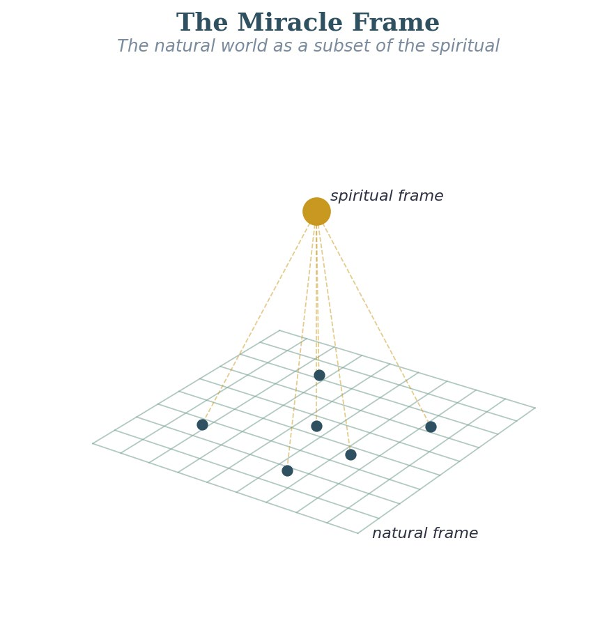

# Connecting the Dots: How the Eight Explorations Fit Together

{: .inset-left}

Standing back from all eight explorations, here is the picture I see emerging.

The Opening Exploration (The Miracle Frame) lays down the basic starting point: the natural world sits inside God’s larger spiritual reality and kingdom, and miracles follow the laws of that larger world. This is not just background — it is the reason the whole investigation matters. If it is true, then understanding these higher laws is the most practical thing I could possibly do.

Explorations 1 through 4 describe the basic structural and operational laws of the spiritual life — how faith is generated (Exploration 1), what the components of a person are (Exploration 2), how faith-hope-love function as an eternal triad (Exploration 3), and how the wisdom cluster operates (Exploration 4). These are the foundational maps.

Explorations 5 through 8 describe four more laws that extend and deepen the first four. The Fear of the Lord (5) supplies the missing gateway for the wisdom cluster and anchors the whole way of knowing behind the investigation. The Obedience Channel (6) explains how revelation flows and why the Word → Hearing → Faith chain depends on how I have responded before. Spiritual Authority (7) introduces the force-multiplier idea and explains why the centurion had greater faith than the disciples who had seen more. Prayer as Resonance (8) works out how prayer actually works — as a wave kept up over time rather than a single one-off request.

**The deeper connection** I see across all eight is that they are all, ultimately, **about alignment**. Faith comes from hearing when I am in alignment with the Word. Wisdom functions when I am in alignment with the Fear of the Lord as my reference point. The Obedience Channel flows freely when I am in alignment with what God has already told me. Authority works when I am in alignment with the delegated structure. Prayer resonates when I am in alignment with God’s will and timing. The spiritual life, seen this way, is fundamentally about getting into and maintaining alignment with how God’s world actually works — which is exactly what Jesus modeled and what He taught His disciples to seek.

The miracle life is not a special privilege for a few. It is the natural result of living in line with these higher laws. That is the exciting and sobering conclusion of everything I have explored so far.

## Some Open Trails

There is far more ahead than what I have mapped so far. The explorations I have identified as some next priorities:

- The Fear of the Lord — Deeper Work: The Fifth Exploration opened a door I have not fully entered. The specific dynamics of how awe and reverence actually transform my reference frame are worth extended treatment.
- The Community Dimension: All eight explorations have collective versions — how do these laws operate at the level of a family, a congregation, a community? Deuteronomy 28 and the letters to the seven churches in Revelation are the primary texts for this.
- Time Delay: Almost every working law has a time delay built into it, and in self-feeding loops a time delay is the main thing that makes them wobble and get misread. This needs its own careful treatment.
- Conservation Laws: If I am right that the spiritual world runs on something like a physics, then there should be conservation rules — what stays constant, what can change form but never be created or destroyed. I have not identified these yet, but I believe they are there.
- **The Trust-Direction Law.** Prov. 3:5–6 names a directional relationship between whole-hearted trust in the Lord and straightened paths, repeated in Ps. 37:5, Isa. 26:3, and Ps. 32:8. I considered this for the Foundational set and held it back: its scriptural base is entirely Old Testament (Solomon, David, Isaiah) and does not clear the cross-Testament bar the other Foundational Laws meet. The natural New Testament candidates — Phil. 4:6–7 on the peace that surpasses understanding, Heb. 4 on rest, 1 Pet. 5:7 on casting anxieties — share the same starting point (trust in God) but name different results (peace, rest, being cared for) than "straightened paths." Whether those New Testament passages describe the same cause-and-effect in different words, or whether Trust-Direction is really an Old-Testament-anchored law whose New Testament echoes are best read as cousins, is still open.
- **The Seek-First-the-Kingdom Provision Law.** Matt. 6:33 and its Synoptic parallel in Luke 12:31 state a directional relationship between prioritizing God's kingdom and material things being added, with indirect Old Testament support (Ps. 37:25; 1 Kgs. 3:11–13). I considered this for the Foundational set and held it back. The matching passage in another gospel really counts as just one witness; the Old Testament support hints at it rather than stating it outright; and it overlaps with the Generosity-Provision Law (FL.IX) on the provision side and with Trust-Direction on the priority side. As it stands, this candidate does not have a cause-and-effect of its own. The natural future home is as a special case of FL.IX — putting the kingdom first as the cause, provision for the one who does so as the result.
- **The Wesleyan-Holiness Tradition.** The Wesleyan-Holiness tradition — the eighteenth-century Methodist revival, the nineteenth-century American holiness movement, the Keswick tradition, and the early Pentecostal sanctification-as-precondition theology — operates with formation distinctives the corpus does not yet absorb. Most consequential: the eighteenth-century Methodist class meeting was a weekly small-group formation structure under a class leader, with mutual confession and accountability, and is the closest historical precedent to the FotH cohort form. Wesley appears in this corpus as an epistemologist (the Wesleyan Quadrilateral grounds Vol 4's testing methodology), not as the founder of a formation tradition; his sermons on entire sanctification, perfecting love, and Christian Perfection are not engaged operationally. The corpus's Reformed-Evangelical orientation does not adopt the Wesleyan perfectionist distinctive, but the operational wisdom of the class meeting on formation-in-community remains real, and the gap should be visible rather than implicit. *Further reading: Maddox's* Responsible Grace*; Outler's Wesley sourcebook; Watson and Kisker on the modern class-meeting recovery.*
- **The Global Pentecostal Tradition.** The corpus's charismatic location is the white evangelical-renewal lineage of the 1970s-onward — Bennett, Wimber, Wagner, and the inner-healing prayer tradition (Payne, Transformation Prayer Ministry) — rather than the broader global Pentecostal movement that preceded it and now dwarfs it in scale. The Azusa Street tradition, the Assemblies of God and the Church of God in Christ, the African-American Pentecostal tradition, and the global Pentecostal explosion that is the largest Christian movement of the last hundred years are largely absent from the corpus's operational engagement. The corpus engages the inner-healing dimension of charismatic renewal but not the public-gifts dimension: prophecy weighed in community per 1 Cor. 14, laying-on-of-hands for healing, tongues as a prayer-language discipline, and words of knowledge have no Vol 2 chapter or tool-protocol presence. Vol 3 forward-references this work as "The Gifts of the Spirit as Force-Amplifying Mechanisms." *Further reading: Synan, Anderson, Yong.*
- **A candid word on spiritual warfare.** Readers who know the Scriptures will notice I've said very little here about spiritual warfare — the powers of darkness, and the deliverance Jesus and the apostles practiced. That's deliberate, and I want to be honest about why. Scripture is plain that the warfare is real: Daniel held up by the prince of Persia, the armor of Ephesians 6, Jesus casting out demons again and again. I don't doubt a word of it. But I've had little direct experience of that kind of conflict myself, and I've held to a simple rule — to write only what the Lord has actually shown me and what I can witness to firsthand, with the Scriptures underneath to test it. Other men I trust, Derek Prince and John Eldredge among them, have walked in that territory and written about it with an authority I haven't earned by experience; I'd point you to them. And this is just where the open-source nature of this whole project matters: it was never meant to stay one man's walk. As the Fellowship of the Heart takes hold, I expect others who have lived this part of the battle to bring what they have seen — and some of that will surely be warfare and deliverance. I will be glad when it comes. Praise God that He gives different members of the body different sight. The Lord never opened my eyes the way He opened the eyes of Elisha's servant — to see the hillside full of horses and chariots of fire, the armies that were there all along. I haven't been given that sight, and I'm at peace with it; He would have shown me if I'd needed it. So I gladly leave that important work to others — to see it, weigh it against Scripture, and write it down — along with much of the life of the Spirit that runs deeper than anything I can picture from here. This was never meant to end with me. It is my prayer, and no small part of why I wrote any of this down, that the Lord would carry you further than He has carried me. Add what He shows you, and let your journey go well beyond mine.
- **The Sacramental and Vocational Tradition.** The sacramental-incarnational tradition — Catholic, Orthodox, Anglican, and Lutheran, with Quaker-incarnational variants — engages formation through dimensions the corpus's Reformed-Evangelical orientation locates differently. Three sub-trails sit here. *The sacraments as formation events:* the Eucharist as a recurring formation moment in traditions of weekly or daily communion, baptism as a formation event with ongoing operational reach, and confirmation as a developmental milestone. V2.Exp4 (Confession-Restoration) makes the only explicit deferral in the current corpus; broader sacramental treatment is absent. *The liturgical year as a formation framework:* Advent, Lent, Pentecost, ordinary time — the FotH 34-Tuesday cycle is governed by the school year rather than by the church year, and how the two relate for communities that observe both has not been engaged. *Vocation as a formation arena:* FotH names "Sent into vocation" as a recognized direction the Spirit calls some cohort members into, but the corpus has no operational treatment of vocation-as-formation in the lineage of Brother Lawrence (*Practice of the Presence of God*), Luther's vocation theology, or the modern faith-and-work integrations (Guinness, Nelson, Sherman, Theology of Work Project). The vocation sub-trail is the most amenable to eventual incorporation as Vol 2 material.
