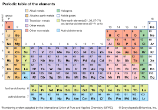

# Third Exploration: The Relationship of Faith, Hope, and Love

## The Starting Point
***1 Cor. 13:13 (ESV)***

*"So now faith, hope, and love abide, these three; but the greatest of these is love."*

Paul names these three as eternal; they will remain when other things have passed away, including knowledge. That alone makes them worth special attention. They are not just virtues or disciplines. They are the permanent building blocks of a life lived in God. My exploration here is about what the relationship among them actually looks like, and which way the arrows between them point.

## Defining the Elements
Faith, as I use it throughout these explorations, is trust, pistis in Greek. It is a present-tense orientation: I trust this person or this word right now, enough to act on it.

Hope, as Derek Prince put it so well, is a confident expectation of future good. It is faith extended into the future tense. Where faith says, "I trust now," hope says, "I expect good ahead." What connects faith and hope is time.

Love is connection, in all its forms. Agape love is the will to the good of the other, independent of feeling. It connects me to God and to others in a way that makes the rest of the spiritual life possible.

## The Directional Relationships
Here is what I have worked out about the arrows, and I want to be precise because the direction matters enormously:

- Faith → Hope: My present trust in God generates confident expectation about my future. Without faith, hope collapses into wishful thinking. Faith is the root; hope is the fruit that grows on that root extended into the future.
- Hope → Love: When I genuinely expect good ahead, I am freed from the guarded self-protection that makes love feel too risky. Hope gives me the security from which love can be given freely. This is the order in Rom. 5:1-5: faith produces peace, peace produces hope through endurance, and the whole thing produces a love poured out by the Spirit.
I want to be clear about where I am reading between the lines here. The Romans 5 order (faith → peace → endurance → hope → love poured out by the Spirit) is my main scriptural anchor for this arrow, and it is a strong one. But 1 John 4:18 runs a related arrow in a direction that could be read as competing: ‘perfect love casts out fear’, which suggests that love itself is what removes the guardedness, rather than hope doing that work so that love can flow. Wayne Grudem would likely note that both texts are true, and that the apparent clash comes from the three genuinely strengthening one another rather than running in a strict order — in a mature believer all three arrows are working at once, and you cannot understand the whole by pulling out a single cause-and-effect chain. I hold Reasonably Inferred confidence in the overall picture, while admitting that the exact direction of the Hope → Love arrow is the part where I am reading in the most.

- Love → Faith: This is the loop closing back on itself. When I am genuinely connected to God and to others in love, my trust deepens. Love is the soil in which faith grows best. This is why the greatest commandment and the great commission are both about love; love is the soil for everything else.
The result is a triangle with arrows running around it in both directions, with love at the top. Run it the good way and each part builds up the next; run it the bad way and each part tears the next down. A life without hope, as someone wise once said, is a dark cave you cannot escape, and I think this little diagram shows exactly why. Take hope away, and you break the link between faith and love. Everything starts to shrink.

I actually use this 1 Cor 13 reference as an early exploration of how things work in the world of the Spirit. I dug into what each word meant and found out that faith (which is also translated as believe) really means trust. The same underlying Greek word gets translated both ways in English. I started using trust when I read scripture to replace those two words. In this process, I came across a wonderful anecdote about Blondin, a 1890s high-wire artist, who put on a demonstration of his skill by stringing a high-wire across Niagara Falls and going back and forth with various challenges. As reported, at one point, he traversed the wire pushing a wheelbarrow. Getting to the ground on one side where an admiring crowd was clapping and cheering, he asked,”Do you believe I can cross this high wire pushing this wheelbarrow?” The crowd said something like “Of course. We just saw you do that.” He responded, “Then get in the wheelbarrow.” That’s what pistis really means: it is getting into the wheelbarrow-type belief or faith. Big impact on me as I read scripture with this word and that image in front of me. I invite you to try it out.

**Proposed Law (Structural/Operational): Faith, Hope, and Love form a threesome that strengthens itself. Faith (trust now) produces Hope (expecting good ahead); Hope frees Love (no longer guarded and self-protecting); Love deepens Faith (it builds the loving connection in which trust grows). Run the right way the three build each other up; run the wrong way they tear each other down.**

**Certainty: Reasonably Inferred  ***Strong scriptural grounding across multiple texts. Which way the arrows point is my reading of the relationship language; it needs community testing and more careful diagram work.*

***A word from your Granddaddy.*** *Let me tell you where a good deal of this began. Early on, when I first set out to explore how the world of the Spirit works, I went looking for its elemental things — the atomic, permanent realities that don’t pass away and so must reflect the very nature of God. And here in Paul’s letter were three named as exactly that: faith, hope, and love, “these three” that abide when all else falls away. That triad gave me an anchor I badly needed, and as I dug into it across the years, one door kept opening onto the next. The first eye-opener was that the faith Scripture keeps asking of us really means trust — not a tip of the hat to an idea, but the kind you stake your weight on. The second was that hope is that same trust carried into the future tense; what separates them is simply time — trust is “now,” hope is “good ahead.” The third was that love is a whole continuum laid over the way we connect to God and to one another — and that one grew into the [Four Connects](../volume-2-knowing-to-doing/exploration-05-four-connects.md) work I’ve led dozens of times over the years. What began as three words I only wanted to understand turned out to be a seed, and the plant that came up from it is, in good part, this very book you’re holding. It has been a joyful unfolding, year upon year, and I am sure there is still more to come — for the things of God never run dry.*

**Connections**

**Formation Documents. ***The self-strengthening threesome lines up with [SST](../volume-5-references/source-pdfs/sst-soul-spirit-taxonomies.pdf){: .pdf-popup data-pdf-label="SST — Soul and Spirit Taxonomies" }’s spirit Stage 3 (Spirit-Empowered Fruitfulness), which SST proposes needs soul Stage 3 (Renewal) as a partner condition. Whether the threesome builds up or tears down may depend partly on whether the soul and spirit are growing at roughly the same pace.*
