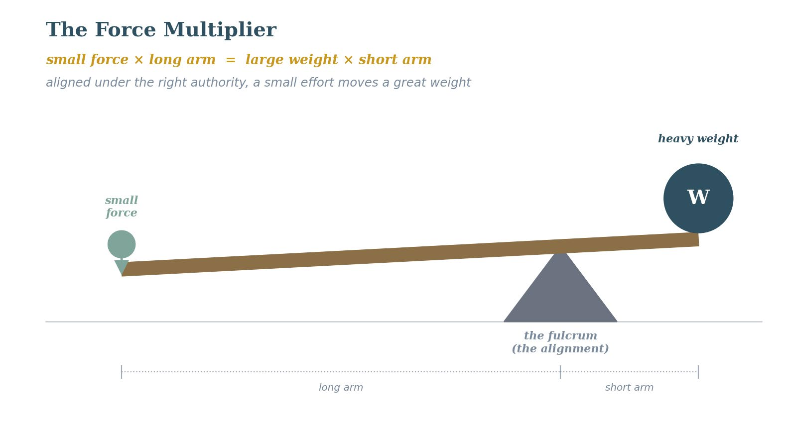

# Fourth Exploration: Wisdom, Knowledge, Understanding, and Discernment

## A Critique of Where I Was
In my earlier drafts of this exploration, I had identified the four elements and done good work defining each word, but I had not yet drawn the arrows between them. I had a vocabulary list without a map. The whole point of this investigation is to describe how things relate, not just to name the parts.

A second thing I missed: this cluster has a gateway — the Fear of the Lord — that opens the door to the whole set. I did not have that in the diagram, which means the diagram was hanging in mid-air, with nothing said about how you get in. I have now moved the Fear of the Lord to its own exploration (the Fifth), which feeds into this one as the thing that has to come first. That changes the picture a lot.

## Defining the Elements with Directionality
***Prov. 1:2 (ESV)***

*"To know wisdom and instruction, to understand words of insight."*

***Prov. 9:10 (ESV)***

*"The fear of the Lord is the beginning of wisdom, and knowledge of the Holy One is understanding."*

Working from the NET Bible and Vine's definitions:

- Knowledge (da'at in Hebrew) is experiential knowing — not merely cognitive awareness but the assimilation and practical use of what has been acquired. You know a thing when you have lived with it, not just when you have memorized it.
- Understanding (binah) is the ability to tell things apart — to compare, to weigh, to see how things relate. Understanding is about relationships; it works in the space between the things you know.
- Wisdom (chokmah) is skill in living — the ability to take what is known and understood and apply it with moral skill to produce something of lasting value. Proverbs describes it the way a craftsman is described: someone who takes raw material and shapes something excellent.
- Discernment (the ability to distinguish the spirits, the kardia of the discernment gift) is the application of all three to a specific present moment — seeing what is actually happening in the spiritual dimension of a given situation.
## The Proposed Directional Structure
Here is the order I propose, from start to finish:

Knowledge is the raw material — truth you have actually met and lived. Understanding works that raw knowledge into a web of relationships — seeing connections, telling things apart, working out what follows. Wisdom takes Understanding and applies it skillfully to produce good outcomes in life. Discernment works in the moment, drawing on Wisdom to find its way through a specific spiritual situation.

The loop back: acting wisely produces new lived Knowledge (you learn by doing well), which feeds Understanding, and on around. Discernment, used well, also produces new Knowledge of what the Spirit is doing, which feeds the whole thing. It can also run the wrong way: skip any of these steps and you block the good cycle. I first made these connections when I started analyzing the PROAPT method of Bible study (see Vol. 2), which was taught to us when we first joined Truro Church. Such a simple process, but with a deep impact on my heart. The universality of this reflective Bible study was highlighted for me when I examined the REVEAL analytic work by Hawkins and Parkinson. Reflective bible study was the one practice with real impact across all the stages of development they identified. That’s a big deal.

But none of this works without the gateway. Without the Fear of the Lord, real Wisdom is simply out of reach. I can have information (logos knowledge) without the Fear of the Lord. I cannot have genuine chokmah — moral skill in living — without it.

**Proposed Law (Structural): Knowledge → Understanding → Wisdom → Discernment, with a loop running from Discernment back to Knowledge. The whole set needs the Fear of the Lord as its gateway (see Fifth Exploration). Without the Fear of the Lord, what looks like wisdom is just cleverness.**

**Certainty: Reasonably Inferred  ***Which way the arrows run is my reading, and it needs more careful scriptural work, especially the Understanding-Wisdom link. The Fear of the Lord as a gateway is high confidence (see the next exploration).*

***A word from your Granddaddy.*** *The discernment in this chapter is the one skill I most had to grow into as I learned to help people — the gift that marks a mature Companion. It is reading, right in the moment, what is actually going on in front of you, and being seasoned enough to change course when you need to — even to stop altogether when a thing is plainly too big for the room you’re in and the person needs real professional help. That last one is the hard one, and it takes genuine listening to the Spirit, because every instinct in a willing helper says press in and make it work. I have learned, sometimes the slow way, that pressing past what the moment can safely hold doesn’t help anyone — it harms the very people you meant to love. Real discernment is as much knowing when to stop as knowing what to say, and you only get it by staying close to the Spirit the whole time. He sees what is truly there; my job is to listen, and to trust Him enough not to force what only He can do.*

**Connections**

**Formation Documents. ***TA’s truth-testing of Kahneman maps System 2 onto the mind’s slow, analytical side and System 1 onto the heart’s quick, deciding side — showing that heart and mind are measurably different and need different kinds of training. This Exploration’s four-element cluster is a map of the mind’s slow, System-2 side; a matching heart-side cluster (the fast, gut-level trust and recognition that runs most of our day-to-day spiritual response) is a natural next exploration.*

**Fifth Exploration — New Discovery**
