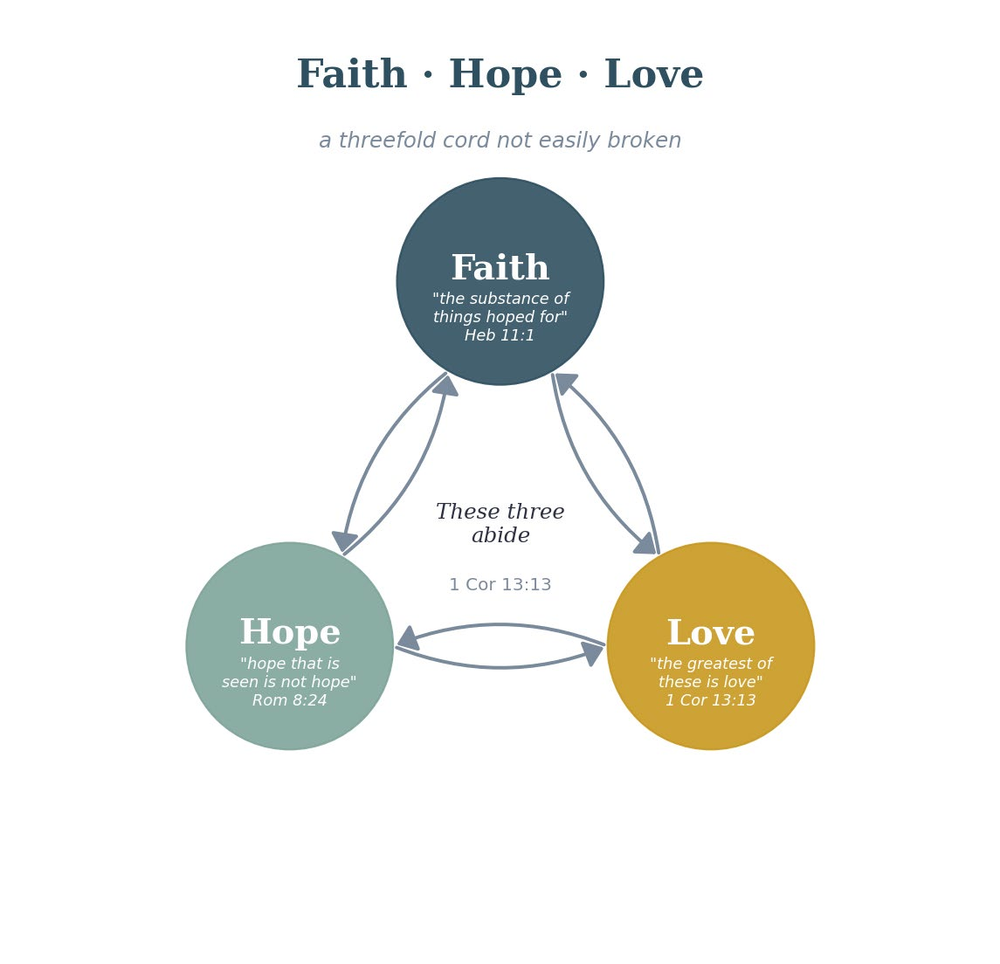

# Fifth Exploration: The Gateway Condition — The Fear of the Lord

{: .fig-pair}{: .fig-pair}

## Why This Is Its Own Exploration
I could have included this as a subsection of the Fourth Exploration, but the more I sat with it, the more I realized the Fear of the Lord deserves its own treatment. It is not just a warm-up to Wisdom — it is the starting point for a whole way of knowing. It changes how I know things, not just what I know. That puts it in a different category from the other parts of the Wisdom cluster. It is the switch that turns the whole thing on — or leaves it off.

## The Scriptural Ground
***Prov. 1:7 (ESV)***

*"The fear of the Lord is the beginning of knowledge; fools despise wisdom and instruction."*

***Prov. 9:10 (ESV)***

*"The fear of the Lord is the beginning of wisdom, and knowledge of the Holy One is understanding."*

***Isa. 11:2-3 (ESV)***

*"And the Spirit of the Lord shall rest upon him, the Spirit of wisdom and understanding, the Spirit of counsel and might, the Spirit of knowledge and the fear of the Lord. And his delight shall be in the fear of the Lord."*

***Ps. 111:10 (ESV)***

*"The fear of the Lord is the beginning of wisdom; all those who practice it have a good understanding."*

Four times in the wisdom literature, the same pattern appears: Fear of the Lord is the beginning — the arche, the origin point, the first cause — of wisdom and knowledge. This is not a suggestion or a nice-to-have. It is stated as a basic, built-in rule. You do not gain genuine wisdom by working harder or studying more. You get it by starting in the right place.

## What Does "Fear of the Lord" Actually Mean?
This is where I want to be careful, because the English word fear flattens something that is much richer in the Hebrew (yir'ah). This is not the terror of a cruel tyrant. It is the awe, reverence, and deep attentiveness that come from meeting the holy. It is the response of a creature who has truly grasped who God is — not as an idea, but as the living God who is at once far above everything and right here with us. Rom. 1:19-20 is relevant here. Creation speaks, all the time, of “His eternal nature and divine power.” That speaking should stir up this kind of fear of an awesome creator God. We might tune it out because it is so familiar, and it's just “natural”, right? That is a heart that has gone hard because what was once awe-inspiring has become ordinary. That hardness is wrapped up in taking God for granted.

What the Fear of the Lord actually does is point me the right way. It puts me in my place — a creature before the Creator. And being pointed the right way is where all real knowing has to start. Without it, I make myself the center of everything; I judge it all from my own small vantage point, which means I start out crooked. The Fear of the Lord sets the true reference point.

## The Electrical Engineering Analogy
I am an electrical engineer by training and trade, so let me reach for an analogy that has helped me. In any electrical circuit there is a "ground" — an agreed zero point that every voltage is measured from. Without that fixed zero, a voltage has no real meaning: you can measure the gap between two points, but with no fixed point to measure from, the numbers just drift. The Fear of the Lord is the spiritual "ground": the fixed zero from which everything else can be measured truly. Trying to know without it is like building a circuit with no fixed ground — everything floats, nothing holds still, and you can't trust any of the readings.

## How This Connects to What I Have Already Built
In the Rom. 10:17 chain, I noted that genuine hearing requires a willingness to obey. I now see that the willingness to obey itself flows out of the Fear of the Lord. If I have truly grasped who God is — if the awe is real — then being willing to obey is not the struggle it would otherwise be. The Fear of the Lord comes before, and shapes, the quality of hearing in the chain that produces faith.

This also connects to the new Sixth Exploration on the Obedience Channel. The Fear of the Lord is what makes obedience the natural response rather than a constant battle of wills.

**Proposed Law (Structural — Gateway): The Fear of the Lord has to be in place before the Wisdom-Knowledge-Understanding-Discernment cluster can work. It is the spiritual "ground" — the fixed point from which all spiritual knowing gets its bearings. Without it, what looks like wisdom is just cleverness working from a crooked starting point.**

**Certainty: Clearly Taught  ***Among the highest-confidence laws in this volume. The scriptural repetition is explicit and consistent across multiple wisdom texts. How it works — getting the self pointed the right way — fits both scripture and experience.*

***A word from your Granddaddy.*** *We are handed these moments all the time — a lightning storm rolling in full of majesty, the ocean throwing enormous waves onto the shore where you stand, a rainbow laid across the sky — and every one of them is creation handing you the words: “You are awesome, God.” The trouble is it all looks so “natural” that we file it under just-nature and walk on by. But Romans 1 says He is always speaking through the things He has made; the only question is whether we are listening with spiritual ears. Here is an engineer’s way to picture it: the radio waves are in this room right now, every station broadcasting at once — but you hear only the one you tune to. The signal is always there; being tuned to the right wavelength is the whole difference between static and a clear voice. So ask Him to tune your heart, and the lightning and the waves and the rainbow stop being just weather — they become the voice of an awesome God, and the awe that wakes in you is the gateway to all the rest.*

**Connections**

**Formation Documents. ***The Fear of the Lord is, on the knowing side, the match to [SST](../volume-5-references/source-pdfs/sst-soul-spirit-taxonomies.pdf){: .pdf-popup data-pdf-label="SST — Soul and Spirit Taxonomies" }’s regeneration threshold — both name a gateway, with IJH describing how it is built and SST describing the point you cross to enter. Both pictures are needed; neither is complete on its own.*

**Sixth Exploration — New Discovery**
