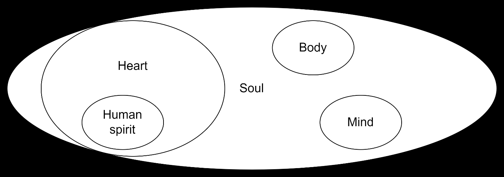

# Sixth Exploration: The Obedience Channel — How Revelation Flows

{: .inset-left}

## The Discovery
This is one of those things that, once I saw it, I could not un-see it. And I am a little embarrassed that I had not formalized it as a law earlier, because it has operated in my life for decades. The law is simple: acting on what God has already shown you is the condition for receiving more revelation.

## The Scriptural Ground
***John 7:17 (ESV)***

*"If anyone's will is to do God's will, he will know whether the teaching is from God or whether I am speaking on my own authority."*

There it is. The condition is willing obedience. The result is knowing. And note the direction: it is not "know first, then obey." It is "be willing to obey, and then you will know." This inverts the way most people think about spiritual growth. We want understanding before commitment. God offers understanding as the fruit of commitment.

C.S. Lewis makes an argument in Mere Christianity that runs right alongside this law and shows why it works. He notes that if you act as if you love your neighbor before you feel love, the feeling tends to follow the action — not because you have tricked your emotions, but because you have lined yourself up with the way reality actually is. Love is the grain or direction of the universe; acting with it puts you in contact with something real. I think the same thing is at work in the Obedience Channel. When I obey before I understand, I am not just passing some random test of loyalty God set up. I am lining myself up with the way the world is built — a world where being willing to obey is what lets you see clearly in the first place. Disobedience, on the other hand, does not just fail to open the channel — it warps the very thing you see with. This is why the author of Hebrews can speak of hearts being hardened through the deceitfulness of sin (Heb. 3:13): steady disobedience does not just block what God shows you, it slowly ruins your ability to receive it at all. The obedience is not the price you pay for revelation; it is fixing the receiver so it works again.

John 7:17 does not stand alone in this. The same direction — obey and revere first, know after — runs through both Testaments. The psalmist says God reserves His intimacy for the obedient-reverent: "The friendship of the Lord is for those who fear him, and he makes known to them his covenant" (Ps. 25:14); and he stakes his own understanding on kept commands: "I understand more than the aged, for I keep your precepts" (Ps. 119:100). Hosea casts it as a pursuit — "let us press on to know the Lord" (Hos. 6:3) — knowing God as something you press toward by following, not something you finish before you begin. The inverse is just as real: Paul describes those "always learning and never able to arrive at a knowledge of the truth" (2 Tim. 3:7) — study cut loose from the willingness to obey that John 7:17 names, which is exactly why the learning never lands.

***John 14:21 (ESV)***

*"Whoever has my commandments and keeps them, he it is who loves me. And he who loves me will be loved by my Father, and I will love him and manifest myself to him."*

The word manifest here is emphao — to show clearly, to make visible. Jesus is saying that experiencing His presence, and His showing Himself to us, depends on keeping His commandments. Obedience is the channel the revelation flows through. This connects right back to the Faith cluster: obedience deepens love, love deepens faith, and faith makes the hearing better.

***1 Sam. 15:22-23 (ESV)***

*"Has the Lord as great delight in burnt offerings and sacrifices, as in obeying the voice of the Lord? Behold, to obey is better than sacrifice, and to listen than the fat of rams. For rebellion is as the sin of divination, and presumption is as iniquity and idolatry."*

Samuel’s rebuke of Saul puts the dark side starkly. Disobedience is not just a moral failure — it is rebellion that works like divination and idolatry. Put plainly: disobedience does not merely fail to open the channel; it slams it shut and fills it with static that drowns out the message.

## The Time Delay
One part of this law that has mattered in my own life is the time delay between obedience and the next revelation. God usually does not give the next instruction the moment I obey the last one. There is a waiting period. This has a few consequences: because the next word comes so much later, it is hard to see that the obedience is what opened the way to it — which is probably why so many people miss it. If the gap between obedience and the next revelation is weeks or months, and I am not paying attention, I may never connect the two.

This is also related to what Jesus says about the virgins with oil in their lamps (Matt 25) — the readiness is maintained by ongoing attentiveness during the waiting period. The obedience that keeps the channel open includes the obedience of staying attentive during the delay.

## The Community Dimension
There is a collective version of this law as well. When a community is in collective disobedience — a shared hardness of heart — the revelation that community could have is held back. Deuteronomy 28 is the great national if-then chapter in the Old Testament: if the community walks in obedience, the outpouring of blessing and revelation follows; if not, the channel closes and the fallout piles up. This deserves its own extended discussion, but I flag it here as an important extension of the personal law.

**Proposed Law (Operational): Obeying what God has already shown you is what opens the way to receiving the next thing. How well you hear in the Word → Hearing → Faith chain depends on your track record of obedience. Obedience keeps the channel open and opens it wider; disobedience clogs it, and over time shuts it completely. There is usually a time delay between obeying and the next revelation, which makes it easy to miss that the one led to the other.**

**Certainty: Clearly Taught ***High confidence. John 7:17 is explicit; the pattern is confirmed across multiple texts and in personal experience. How the time delay works, and what it means, is still being worked out.*

**Connections**

**Vol 3. ***Formalized as the Faith-Obedience Reinforcing Engine in Vol 3 (Exp. 7: Feedback Loops): the self-feeding loop in which obedience brings confirmation, confirmation increases trust, and trust produces more obedient action. Vol 3 treats the time delay introduced here as a key number to measure.*

**Formation Documents. ***Obedience to prior revelation is what [HFT](../volume-5-references/source-pdfs/hft-heart-formation-theology.pdf){: .pdf-popup data-pdf-label="HFT — Heart Formation Theology" }’s Affective Level 3 (Valuing) looks like from the outside. [MSFIG](../volume-5-references/source-pdfs/msfig-model-spiritual-formation.pdf){: .pdf-popup data-pdf-label="MSFIG — Model of Spiritual Formation for Individuals and Small Groups" } develops this further: the Willard-Friesen debate about everyday guidance **is resolved by the taxonomy precisely at this point. The time delay flagged in this Exploration’s Certainty matches MSFIG’s treatment of Brueggemann’s “disorientation” as something that forms us.*

**Seventh Exploration — New Discovery**
