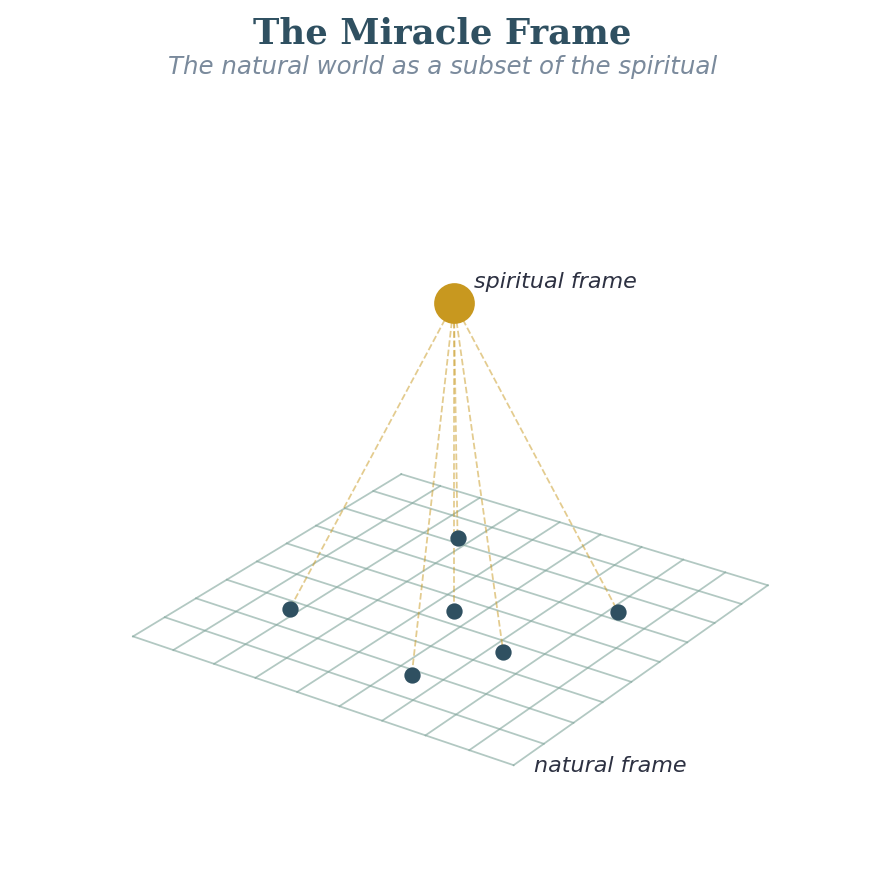

# Opening Exploration: The Miracle Frame — The Natural World as a Subset

## Why This Has to Come First
I originally had this discussion buried in the Framework section near the middle of this document. As I reviewed the structure of Vol 1, I realized that it was a mistake. This is the foundational premise of the entire investigation. If I can’t establish it, everything else I am doing is just interesting theology. If I can establish it, even at Reasonably Inferred certainty, then the rest of this work is not just interesting, it is urgent.

The premise is this: miracles are not violations of natural law. They are a higher law at work on the natural world — reaching in from a larger reality that holds the natural world inside it. The urgency is this: if we can see into these spiritual laws, even in part, we should be able to follow Jesus more closely, and to see and share in more of what God is doing — just as Jesus showed us and invites us into. As He said, if we love Him, we will obey His commands. This is about becoming soil (hearts) that hears and obeys, quickly and quietly.

## The Physics Analogy
Here is the analogy from physics that I find most compelling. For two hundred years, Newton’s laws of motion were thought to be the complete description of the physical world. Then Einstein showed that Newton’s laws are really just a special case — they give the right answers at everyday speeds and ordinary gravity, but they turn out to be a small slice of a much bigger picture. From inside Newton’s smaller picture, Einstein’s effects look impossible, or at least strange. From inside Einstein’s bigger picture, they follow the rules perfectly.

C.S. Lewis reaches the same bigger-picture conclusion from a different, more philosophical direction. In Miracles, he argues that naturalism — the claim that the physical universe is all there is — defeats itself, because the very act of reasoning your way to that conclusion requires you to trust your mind to actually track the truth. But if our minds are nothing but physical processes, there is no more reason to trust them than to trust a calculator that has been dropped. Reason, Lewis argues, must be something that comes into the natural world from outside it — which is exactly the inside-a-bigger-thing relationship I am describing from scripture. I find it striking that the physicist’s analogy, the philosopher’s argument, and the apostle’s statement in Heb. 11:3 all land on the same point: the natural world comes from, and is held up by, something larger than itself.

I believe miracles work the same way. The natural world is a smaller picture of a larger spiritual reality. When Jesus walks on water, He is not breaking the law of gravity. He is acting from a larger reality in which gravity is only part of the picture. The miracle is not strange from inside the larger picture; it only looks strange from inside the natural one.

I want to be clear that this is a picture, not a proof. The physics is only an analogy — a way to imagine how something can be completely orderly in a bigger frame while looking impossible from inside a smaller one. I am not saying miracles *are* physics, or that God works by equations. God is a Person who acts freely; the comparison is just a doorway for the imagination.

## The Scriptural Ground
***Heb. 11:3 (ESV)***

*"By faith we understand that the universe was formed at God's command, so that what is seen was not made out of what is visible."*

This is a remarkable statement. It says the visible world was constructed from the invisible one. The natural is not self-contained; it is derived from the spiritual. The spiritual is not a separate domain that occasionally intersects the natural. The natural is a subset of the spiritual, the way a two-dimensional cross-section is a subset of the three-dimensional object it cuts through.

***Col. 1:15-17 (ESV)***

*"He is the image of the invisible God, the firstborn of all creation. For by him all things were created, in heaven and on earth, visible and invisible, whether thrones or dominions or rulers or authorities — all things were created through him and for him. And he is before all things, and in him all things hold together."*

Paul is saying that the structural coherence of the natural world, the fact that it holds together at all, is a function of Christ’s ongoing sustaining activity. The natural world is not self-sustaining. It is upheld by a spiritual reality. That is exactly the subset relationship I am describing.

***2 Kgs. 6:15-17 (ESV)***

*"When the servant of the man of God rose early in the morning and went out, behold, an army with horses and chariots was all around the city. And the servant said, 'Alas, my master! What shall we do?' He said, 'Do not be afraid, for those who are with us are more than those who are with them.' Then Elisha prayed and said, 'O Lord, please open his eyes that he may see.' So the **Lord opened the eyes of the young man, and he saw, and behold, the mountain was full of horses and chariots of fire all around Elisha."*

This is the clearest illustration I know of the larger frame being literally revealed. The spiritual army was already there. The servant couldn’t see it. Elisha could. The miracle was not the army’s arrival; it was the opening of the young man’s eyes to what was already present. This is what I mean when I say the natural world is a subset. The larger reality is already here. Most of us just can’t see it yet.

May the Lord open our eyes and show us what is actually before us, if we are ready to see.

## What This Means for How Miracles Work

If the world we can see is a small part of God's larger reality, then a miracle is a moment when God reaches from that larger reality into our smaller one. This matters, because it means miracles are not magic and not chaos. They are not God acting at random. They flow from who God is, and He is perfectly faithful and consistent. In fact, the Bible most often calls miracles *signs* — because their whole purpose is to show us who God is and to point us to Jesus.

But here is the part that is easy to get wrong. God is a Person, not a machine — and definitely not a vending machine. We do not earn a miracle by getting some spiritual technique exactly right, and we cannot force God's hand by working up enough faith. He is the King. He decides when, whether, and how He acts, and He is always good. The clearest picture of this is Elisha's servant: the miracle was not that God suddenly sent an army — the army was already there. The miracle was that God opened the young man's eyes to see what was already real (2 Kgs. 6:15-17). Very often, that is exactly what a miracle is: God letting us see, and step into, what He is already doing.

So as we learn to live God's way — loving Jesus and obeying Him — we are not learning to run a machine. We are drawing close to a Person, and being brought near to what He is doing, so that we get to take part in it. But the power is always His, and the timing is always His.

And hear this carefully, because it cuts both ways: if you pray and the miracle does not come, it does not mean you failed, or that your faith was too small. Paul begged God three times to take away his "thorn," and God said no — and then used it for good (2 Cor. 12:7-9). Shadrach, Meshach, and Abednego told the king that God was able to rescue them, "but if not," they still would not bow (Dan. 3:16-18). Even Jesus, in the garden, prayed, "not my will, but yours, be done" (Luke 22:42). Faith is not a lever that makes God act. Faith is trust in a Father who is always good — whether He gives the miracle or walks with us through the fire. And if you are in a long *dry season* — not just one unanswered prayer, but a stretch where God feels far off and nothing seems to work — there is a fuller word written for you in [A Word for the Dry Season](spiritual-force-energy-and-power.md#a-word-for-the-dry-season).

**Proposed Law: The world we can see is only a small part of God's larger reality — His kingdom. Miracles are not God breaking the rules of nature. They are moments when God acts from that larger reality, where what looks impossible to us is completely normal to Him. Miracles are His *signs*: He gives them freely, in His own way and timing, to show who He is and to point us to Jesus. As we learn to live God's way and walk closely with Jesus, we are drawn near to what He is doing and get to share in it — but the power and the timing are always His, never something we control.**

**Certainty: Reasonably Inferred  ***The big idea here is strong and grounded in Scripture. Exactly how these higher laws work in detail is the open trail ahead of us.*

**Connections**

**Formation Documents. ***The natural-as-part-of-the-spiritual picture is the big assumption underneath [SST](../volume-5-references/source-pdfs/sst-soul-spirit-taxonomies.pdf){: .pdf-popup data-pdf-label="SST — Soul and Spirit Taxonomies" } and [MSFIG](../volume-5-references/source-pdfs/msfig-model-spiritual-formation.pdf){: .pdf-popup data-pdf-label="MSFIG — Model of Spiritual Formation for Individuals and Small Groups" }: being born again is something the Spirit does, sovereignly, at a threshold — not a level a person reaches by their own growth. The open question this raises for Vol 3 is whether the measuring program can eventually describe how much more a person at Spirit Stage 5 can take in and carry than a person at Stage 1.*
