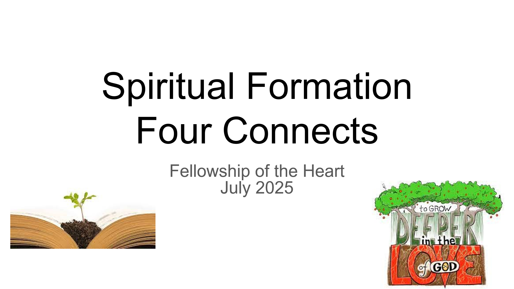

# The Periodic Table of Spiritual Laws — A Summing and Organizing Reference

This chapter is the consolidated Periodic Table reference for the entire Laws-of-the-Spirit investigation. It was originally drafted as the closing chapter of Volume 1 and now lives here in Volume 5, alongside the Tool Inventory and the Companion-formation chapters, because the table’s primary function is reference-and-orientation across the whole corpus rather than further argument within any single volume. Volume 1 introduces the Foundational Laws as a tier ahead of its eight Explorations; Volume 2 maps the Diagnostic, Tool-Application, and Developmental laws that operate downstream of the Vol 1 framework; Volume 3 reframes both sets in field-theoretic terms; and this table is the consolidated organizer that holds all three views in one frame so a Companion in training or in formation work can find any specific law by its place in the structure.

The Periodic Table is not merely a summary. It is itself an analytical instrument that sums (every analyzed law arrayed in one frame), organizes (by the two axes that the investigation has earned the right to use — Period 0–5 for scale of operation and Group I–VI for dimension of the person primarily addressed), and reveals (gaps where a law must exist but has not yet been found; family resemblances among laws sharing a Period or Group; periodicities that recur across scales and dimensions). The chapter retains its original Vol 1 structure for that reason: the Two Axes section explains the analytical instrument’s shape; What the Shape Reveals is the insights section that surfaces the patterns the table makes visible; the Slim Format and Reference List are the consolidated data; the Six Group Families closes structurally; and the Six Priority Open Unknowns is the suggested-actions section that names what the table tells the corpus to look for next. A Companion using this table in training will find each of the laws they are operating with placed in relation to every other; a researcher will find the priority research questions named explicitly at the close. Vol 5 v5_6_0_4 adds a sixth subsection — Reading the Table Through Classical Doctrine — that applies a second analytical lens to the consolidated set: the same arrayed laws read through the four organizing categories of classical soteriology (regeneration, justification, sanctification, union with Christ), responding to Wayne Grudem’s peer-review recommendation that the corpus show its location relative to inherited doctrinal categories.

The table currently holds 28 analyzed laws drawn from across the three primary volumes and the associated formation documents, including 13 Foundational Laws of wide consent (FL.I–XIII), 9 speculative extensions marked with ◆, 6 open unknowns marked [ OPEN UNKNOWN ], 1 anomaly, and 6 forward-references to Volume 3’s field-theoretic appendix. Confidence is expressed in qualitative tiers, not statistical probabilities. The three tiers Vol 1 defines — Clearly Taught (taught directly by scripture or confirmed by community testing), Reasonably Inferred (reasonably inferred from scripture, still in need of community testing), and Speculative (interesting enough to pursue, not yet solid enough to build on) — do the actual epistemic work; see Vol 1's tier description for the full definitions. Volume 1 v5_6_0_18 added two new Foundational Laws since the previous version of this table (FL.III Heart-Throne Law and FL.VIII Desire-for-God Law), and the table is synced to current Vol 1 numbering as of this volume’s v5_6_0_3.

I want to explain the reasoning behind this structure before I show you the table itself — because the structure is a hypothesis, not a presentation. If I have chosen the wrong axes, the table will look tidy, but it won't teach anything new. If I have chosen the right ones, it will show us where the investigation is dense, where it is sparse, and most importantly, **where there are laws that must exist but that we have not yet found**. Those gaps are the most valuable thing the table can produce.

The Periodic Table of Elements was a scientific breakthrough, not because Mendeleev was a better cataloguer than his contemporaries, but because he noticed something his contemporaries missed: *periodicity*. The same chemical behavior — the same valence, the same reactivity — kept reappearing at regular intervals as atomic number increased. Organizing by that repeating pattern revealed a structure that **predicted the existence and properties of undiscovered elements**. The gaps in the table were not failures. They were research assignments.

I believe the Laws of the Spirit have a periodicity. The same underlying mechanism keeps reappearing at different scales and in different dimensions of the person. Let me name three instances before I defend my axis choices.

**The channel-opening / channel-blocking mechanism** appears at the individual level (Obedience Channel, Sin Blockage, Forgiveness-Debt Transfer), at the small group level (Container Law, Community Amplification's gnostic warning), and — speculatively — at the generational level (Generational Transmission). Same mechanism, different scale. A law governing channel dynamics at the congregational level almost certainly exists, but we have not found it yet.

**The attention-conformity mechanism** appears in the soul's movement toward its sustained object of attention (the Attention Economy of the Soul), in the Faith-Hope-Love triad's reinforcing loop, and in the Worship Alignment Law's claim about perception recalibration. Same underlying dynamic: what you direct sustained attention toward, you move toward and are changed by.

**The threshold / gateway structure** appears in the Fear of the Lord as the entry condition for the Wisdom cluster, in the Affective Level 2→3 transition as the critical formation threshold, in regeneration as the entry condition for spirit formation, and in the Miracle Threshold Events model. Each is logically prior to what follows it; each requires a specific condition to be met before the next stage becomes available.

These repetitions are the periodicity. The table is built around them. Also note that the elements are drawn from all three volumes of this IJH work.

A fourth periodicity belongs alongside the three above: reciprocity-of-response. God's response is structured in kind by the person's posture. The locus classicus is Ps. 18:25–26 (ESV): “With the merciful you show yourself merciful; with the blameless man you show yourself blameless; with the purified you show yourself pure; and with the crooked you make yourself seem tortuous.” This is distinct from channel-opening (which is one-directional), from attention-conformity (which shapes the attender rather than the attended), and from threshold (which is binary). It surfaces in the Drawing-Near Reciprocity, Humility-Exaltation, Reciprocal Forgiveness, and Generosity-Provision dynamics. I am naming it as a fourth periodicity rather than reorganizing the table around it; it functions as an additional analytical lens for reading the table.

## The Two Axes
**Axis 1 (the rows — the 'Period' analog): Scale of operation. **Individual → Dyadic/Small Group → Community/Congregation → Generational/Historical → Cosmic/Eschatological. My argument for this axis: almost every law we have found has a version that operates at multiple scales simultaneously, and the laws at each scale form a genuine family — they share mechanism but differ in their unit of analysis, their time constant, and their feedback dynamics. The Obedience Channel law operates in an individual's daily walk; it also operates in a congregation's collective faithfulness over decades; and it arguably operates in a civilization's relationship to revealed truth across centuries. Those are the same law at three different scales, which means the table should show them in the same column.

**Axis 2 (the columns — the 'Group' analog): Dimension of the person primarily addressed. **Spirit → Heart → Soul → Mind/Will → Body/Action → Structural Frame. My argument is that the Formation Documents establish that each dimension has its own developmental logic, its own scriptural vocabulary, and its own relationship to the Spirit's work. Laws that primarily operate in the spirit dimension (Fear of the Lord, Miracle Frame, Prophetic Imagination) share a family resemblance different from laws operating in the heart dimension (Faith Generation, Hearing Development, Community Amplification). The Structural Frame column catches laws that are primarily architectural — they describe the landscape within which the other laws operate.

I considered two alternative arrangements. *Directionality of causation* (God→Human / Human→God / Human→Human) would reveal different patterns, particularly around laws governing divine initiative vs. human cooperation — a theologically important axis I am not capturing here. *Law type* (Structural / Operational / Diagnostic / etc.) would make the existing taxonomy visible, but would reproduce what the Master Law Index already shows, without generating new predictions. I chose Scale and Dimension because they produce the most interesting gaps, which is the test.

## What the Shape of the Table Reveals
**Period 1 (Individual) is the densest row. **It holds 11 of the 26 confirmed laws. This is not surprising — the investigation began with my own interior life and expanded outward. But it means that individual-level laws are well lit, while community, generational, and cosmic laws remain largely dark.

**Group VI (Structural Frame) is the most confirmed column. **We have structural frame laws at Individual, Dyadic, Community, and Cosmic scales — the architecture of the system is becoming visible. The Period 5 / Group VI cell has four entries: TFT, Spiritual Distance, Quantification Program, and the Glory Attractor. This density in the frame column is appropriate. You need the map before you can navigate.

**Period 4 (Generational) is the most underdeveloped row. **It has five open unknowns or speculative entries. Scripture has a great deal to say about generational dynamics — the Deuteronomic narrative, the Abrahamic covenant, the transmission of blessing and curse, Paul's language about Timothy — but we have not yet developed that material into law-form. This is probably the most practically important period for family formation and long-horizon discipleship.

**Group I (Spirit) has a striking gap at Periods 3 and 4. **We have the Fear of the Lord (individual entry condition), the Miracle Frame (cosmic), and the Prophetic Imagination and Prayer Resonance (dyadic, the latter confirmed). But we have no confirmed law governing how the Spirit operates distinctively through a gathered body (Period 3) or how Spirit anointing transmits across generations (Period 4). The Elijah/Elisha double-portion pattern, the Acts 13 gathered-body discernment moment, the Pentecost pattern — these are pointing at something not yet articulated.

**Group V (Body/Action) now contains the Forgiveness-Debt Transfer Law **as a confirmed speculative entry at Period 2, alongside Sin Blockage. The two laws are the same mechanism viewed from two different angles: Sin Blockage is unconfessed sin as a load that closes the channel; Forgiveness-Debt Transfer is unforgiveness, which reinstates* the debt structure that dissolves it*. They are chemical analogs — both Group V, Period 2 — describing how enacted responses to moral failure either open or close the circuit.

**The anomaly entry deserves special attention. **The Skill Development Law (V2.Exp10, Reasonably Inferred) does not fit cleanly into any single cell — it spans Individual and Community scales simultaneously, because skills develop in individuals, but the conditions for that development are almost entirely community-dependent. In chemistry, hydrogen's ambiguous placement (it could go in Group I with the alkali metals, or Group VII with the halogens) was a clue to its unique properties. The Skill Development Law's ambiguous placement may point to a missing meta-law about how formation systems transfer across* scales* — a law about the interface between individual development and community context.

**The Periodic Table of Spiritual Laws — Revised Working Draft**

*28 analyzed laws · 13 foundational laws  ·  9 speculative extensions (**◆**)  ·  6 open unknowns  ·  1 anomaly*

## The Periodic Table of Spiritual Laws — Slim Format
*28 analyzed laws  ·  13 foundational laws  ·  9 speculative extensions (◆)  ·  6 open unknowns  ·  1 anomaly  ·  6 Vol 3 forward-references (see appendix)*

**HOW TO READ THIS TABLE**

**Directionality tag (V/H/B/I):** (V) Vertical (Person↔God); (H) Horizontal (Person↔Person); (B) Both; (I) Intra-personal.

**Confidence:** Three qualitative tiers: Clearly Taught (taught directly by scripture or confirmed by community testing); Reasonably Inferred (reasonably inferred from scripture, still in need of community testing); Speculative (interesting enough to pursue, not yet solid enough to build on). The previous numeric-percentage scheme is retired; see Vol 1 for the full tier definitions.

**Speculative marker:** ◆ marks entries not yet at the threshold of confirmation.

**Provenance prefixes:** FL.I–XIII = Foundational Laws (current volume); V1.ExpN = Vol 1 Exploration N; V1.Open = Vol 1 Open Trail; V2.ExpN / V3.ExpN = forward references to Volume 2 or 3; SST / MSFIG / HFT = Formation Documents; Speculative = proposed but not yet held at a Vol 1 Exp level.

**Other markers:** ⚠ = anomalous placement; [ OPEN UNKNOWN ] = predicted gap, not yet developed. → See Vol 3 Preview appendix = entry deferred to the appendix at the end of this volume.

**Reference list:** Each entry’s description, scriptural anchors, and Mirror field (where applicable) appears in the numbered reference list following this table, ordered by Period and Group.

|  | GROUP ISpirit (innermost) | GROUP IIHeart (desire / will) | GROUP IIISoul (integration) | GROUP IVMind / Will (cognition) | GROUP VBody / Action (embodied) | GROUP VIStructural Frame (architecture) |
| --- | --- | --- | --- | --- | --- | --- |
| PERIOD 0Scale-Invariant |  |  |  |  | Hear-and-Obey Blessing Law (V)FL.VI (Foundational)  Clearly TaughtGenerosity-Provision Law (B)FL.IX (Foundational)  Clearly Taught | Sowing-and-Reaping Law (B)FL.I (Foundational)  Clearly Taught |
| PERIOD 1Individual (sole actor) | Fear of the Lord (V)V1.Exp5 (Gateway)  Clearly TaughtDrawing-Near Reciprocity Law (V)FL.VII (Foundational)  Clearly TaughtAsk-Seek-Knock Law (V)FL.X (Foundational)  Clearly Taught | Faith Generation (Hearing Chain) (V)V1.Exp1  Reasonably InferredFaith-Hope-Love Triad (V)V1.Exp3 (Mixed)  Reasonably InferredHeart-Throne Law (B)FL.III (Foundational)  Clearly TaughtDesire-for-God Law (V)FL.VIII (Foundational, Mixed)  Clearly TaughtPure-Heart Vision Law (V)FL.XIII (Foundational, Gateway)  Clearly Taught | Soul Disorder Awareness (I)SST Stage 1  Reasonably Inferred ◆Humility-Exaltation Law (V)FL.IV (Foundational)  Clearly Taught | Wisdom Cluster (K→U→W→D) (I)V1.Exp4  Reasonably InferredRenewal-of-Mind Transformation Law (V)FL.XI (Foundational)  Clearly Taught | Obedience Channel (Revelation Flow) (V)V1.Exp6  Clearly TaughtSpiritual Authority (Force Multiplier) (B)V1.Exp7  Reasonably InferredConfession-Restoration Law (V)FL.II (Foundational)  Clearly Taught | Nested Person Structure (I)V1.Exp2  Reasonably Inferred |
| PERIOD 2Dyadic / Small Group | Prayer Resonance (Waveform Model) (V)V1.Exp8  Reasonably InferredProphetic Imagination (V)Speculative  Speculative ◆ | Hearing Development (5-Stage Affective) (V)V2.Exp7  Reasonably Inferred | Emotional Knot Law (I)V2.Exp2  Clearly TaughtTool-Application (Discernment Required) (I)V2.Exp6  Reasonably Inferred | Cognitive Root of Knots (I)V2.Exp3  Reasonably Inferred | Sin Blockage Law (Circuit Load) (V)V2.Exp4  Clearly TaughtForgiveness-Debt Transfer Law (B)Speculative  Reasonably Inferred ◆Reciprocal Forgiveness Law (B)FL.V (Foundational)  Clearly TaughtHonor-Authority Flourishing Law (B)FL.XII (Foundational)  Clearly Taught | Four Connects (Self→Others→God→Mission) (B)V2.Exp5  Reasonably Inferred |
| PERIOD 3Community / Congregation | [ OPEN UNKNOWN ]Gathered-Body Discernment Law | Community Amplification (H)V2.Exp9  Reasonably Inferred | Confession-Clarity Law (B)Speculative  Reasonably Inferred ◆ | Container Law (Safe/Present/Clear/Intentional) (H)V2.Exp8  Reasonably Inferred | Heart Soil Diagnostic (I)V2.Exp1  Clearly Taught | ⚠ ANOMALY: Skill DevelopmentV2.Exp10  Reasonably Inferred |
| PERIOD 4Generational / Historical | [ OPEN UNKNOWN ]Spirit Anointing Transmission Law | Gratitude Amplifier (V)Speculative  Speculative ◆[ OPEN UNKNOWN ]Household Formation Law | Generational Transmission (H)Speculative  Speculative ◆ | [ OPEN UNKNOWN ]Doctrinal Calcification Law | [ OPEN UNKNOWN ]Thick Practice Transmission Law | [ OPEN UNKNOWN ]Generational Nested Structure Law |
| PERIOD 5Cosmic / Eschatological | Miracle Frame (Natural ⊂ Spiritual) (V)V1.Open  Reasonably Inferred | Worship Alignment Law (V)Speculative  Speculative ◆ | Suffering-as-Formation Loop (V)MSFIG / Spec  Reasonably Inferred ◆ | Attention Economy of the Soul (V)Speculative  Reasonably Inferred ◆ | → See Vol 3 Preview appendix: Spiritual Force Equation, Miracle Threshold Events | → See Vol 3 Preview appendix: TFT Structural Law (Transcendental Field), Spiritual Distance Metric, Quantification Program, Glory Attractor / Eschatological Law |

## Reference List for the Periodic Table
Each non-Vol-3 entry from the table above appears below in Period/Group order. Vol 3 forward-references are listed separately in the Vol 3 Preview appendix at the end of the volume.

### PERIOD 0 — Scale-Invariant
**P0/GV · FL.VI (Foundational) — Hear-and-Obey Blessing Law (V), Clearly Taught**

Hearing the word of God and doing it produces blessedness and flourishing of the form proper to the unit operating in the law; hearing without doing forfeits the blessing. Scale-invariant (P0). Bidirectional in the source texts.

**P0/GV · FL.IX (Foundational) — Generosity-Provision Law (B), Clearly Taught**

Generous giving evokes provision toward the giver, in varied forms, with characteristic time delay. Withholding evokes the inverse. Specialization of Sowing-and-Reaping in the material/relational substrate. Scale-invariant (P0); bidirectional (B).

**P0/GVI · FL.I (Foundational) — Sowing-and-Reaping Law (B), Clearly Taught**

What a person, community, or generation sows, that unit reaps — in kind, in degree, with characteristic time delay. Scale-invariant; bidirectional (B). Anchor entry for the Period 0 row.

### PERIOD 1 — Individual (sole actor)
**P1/GI · V1.Exp5 (Gateway) — Fear of the Lord (V), Clearly Taught**

Logically prior entry condition for the entire Wisdom cluster; without it, apparent wisdom is cleverness from a distorted reference point.

***Mirror: ****“Fools despise wisdom and instruction” (Prov. 1:7b). Despising the Lord is the gateway-blocking condition: it does not produce a different output; it produces the absence of the Wisdom-cluster output entirely.*

**P1/GI · FL.VII (Foundational) — Drawing-Near Reciprocity Law (V), Clearly Taught**

Active movement toward God evokes God’s movement toward the person; turning away evokes withdrawal. The clearest example of reciprocity-of-response, the fourth periodicity.

**P1/GI · FL.X (Foundational) — Ask-Seek-Knock Law (V), Clearly Taught**

Persistent, faith-filled asking in alignment with God’s character produces receiving; asking from wrong motive (James 4:3) does not. Threshold form of the prayer mechanism; parent-child pair with the Prayer Resonance Law at P2/GI.

**P1/GII · V1.Exp1 — Faith Generation (Hearing Chain) (V), Reasonably Inferred**

Word → Hearing → Faith; genuine willingness to obey activates the chain; disobedience degrades it.

**P1/GII · V1.Exp3 (Mixed) — Faith-Hope-Love Triad (V), Reasonably Inferred**

Mutually reinforcing triad: Faith generates Hope; Hope enables Love; Love deepens Faith. Self-reinforcing upward and self-degrading downward.

**P1/GII · FL.III (Foundational) — Heart-Throne Law (B), Clearly Taught**

Whatever the heart looks to as its primary source of security, meaning, or identity functions as its functional savior; the heart cannot be healed of its idols by clearing or confession alone but requires the dethroning of the false god and the re-enthroning of Christ in the heart’s central place. Structural pair with FL.II Confession-Restoration at the sin-clearance altitude: confession clears the sin act; the Heart-Throne Law dethrones the false god the sin was serving.

***Mirror: ****Whatever a person enthrones at the heart’s center governs the operation of the rest of the laws; idolatry redirects the operational laws toward the false savior, producing the appearance of the law-form without the law-substance (Jer. 2:13; Col. 3:5; 1 John 5:21).*

**P1/GII · FL.VIII (Foundational, Mixed) — Desire-for-God Law (V), Clearly Taught**

The human heart, made for God, generates a longing for him as a structural feature of its design (Eccl. 3:11); this longing precedes the participant’s awareness of its true Object, survives every substitutional attempt to fill it with something else, and operates as the inward signal that the participant was created for communion with God in Christ. Pairs with FL.VII Drawing-Near Reciprocity as its inward-signal complement (the longing is the engine of the seeking) and with FL.III Heart-Throne as the inverse-side coverage (what the heart was made to want before idolatry redirected it).

**P1/GII · FL.XIII (Foundational, Gateway) — Pure-Heart Vision Law (V), Clearly Taught**

Purity of heart is the prior condition for the seeing of God, in both the present-perception and eschatological-vision senses. Second Gateway-type entry alongside Fear of the Lord (V1.Exp5); the seeing follows the purity, not the other way around.

***Mirror: ****Impurity or divided heart blocks the seeing entirely, not partially. Cherished sin functions as the gateway-blocking condition: it does not produce a different kind of vision; it produces the absence of the seeing (Ps. 66:18; Isa. 59:2).*

**P1/GIII · SST Stage 1 — Soul Disorder Awareness (I), Reasonably Inferred ◆**

Recognition of interior fragmentation as precondition for clearing; makes scripture’s claims feel personally urgent rather than abstractly interesting.

**P1/GIII · FL.IV (Foundational) — Humility-Exaltation Law (V), Clearly Taught**

Self-humbling before God leads to being exalted in due time; self-exaltation leads to being brought low. Bidirectional in source texts.

**P1/GIV · V1.Exp4 — Wisdom Cluster (K→U→W→D) (I), Reasonably Inferred**

Knowledge → Understanding → Wisdom → Discernment with feedback loop; Fear of the Lord is the required gateway; without the gateway, output is cleverness, not wisdom.

**P1/GIV · FL.XI (Foundational) — Renewal-of-Mind Transformation Law (V), Clearly Taught**

Sustained renewal of the mind through engagement with God’s truth produces transformation of the whole person; sustained conformity to the surrounding pattern produces deformation. Period 1 anchor of the same mechanism the speculative Attention Economy of the Soul (P5/GIV) describes at cosmic scale; the two form a parent-child pair on the same dynamic at different scales.

***Mirror: ****Conformity to the pattern of the surrounding age (Rom. 12:2a) is the negative direction: the same mechanism (sustained attention shaping the person) pointed at a different source, with deformation as the output.*

**P1/GV · V1.Exp6 — Obedience Channel (Revelation Flow) (V), Clearly Taught**

Obedience to prior revelation is the causal condition for subsequent revelation; disobedience introduces resistance and, compounded, closes the channel entirely.

***Mirror: ****Disobedience to prior revelation introduces resistance into the hearing channel; compounded disobedience progressively closes the channel (Heb. 3:13 hardening; 1 Sam. 15:22-23 rebellion-as-divination).*

**P1/GV · V1.Exp7 — Spiritual Authority (Force Multiplier) (B), Reasonably Inferred**

Authority delegated hierarchically: Father → Son → believers; operating within delegated authority amplifies effective spiritual force.

**P1/GV · FL.II (Foundational) — Confession-Restoration Law (V), Clearly Taught**

Honest, owned confession of sin restores fellowship and clears the channel; concealment maintains the breach. Vertical complement to the Sin Blockage Law at P2/GV.

**P1/GVI · V1.Exp2 — Nested Person Structure (I), Reasonably Inferred**

Spirit ⊂ Heart; Heart, Mind, and Body ⊂ Soul; lasting change always works from inside out; transformation that does not reach innermost layers is incomplete.

### PERIOD 2 — Dyadic / Small Group
**P2/GI · V1.Exp8 — Prayer Resonance (Waveform Model) (V), Reasonably Inferred**

Maximum spiritual force when direction, timing, and persistence align; resonance builds with sustained waveform; applies in dyadic prayer partnership.

**P2/GI · Speculative — Prophetic Imagination (V), Speculative ◆**

Capacity to perceive an alternative to present visible reality is trainable; precondition for faith action at scale; sustained engagement with prophetic literature expands range.

**P2/GII · V2.Exp7 — Hearing Development (5-Stage Affective) (V), Reasonably Inferred**

Affective progression: Receiving → Responding → Valuing → Organization → Characterization; critical transition is Level 2 → Level 3 (extrinsic to intrinsic motivation).

**P2/GIII · V2.Exp2 — Emotional Knot Law (I), Clearly Taught**

Sustained energetic load on the heart created by unresolved loss, believed lie, injustice, unconfessed sin, or incomplete communication; Spirit-delivered revelation to specific location required.

**P2/GIII · V2.Exp6 — Tool-Application (Discernment Required) (I), Reasonably Inferred**

Matching the right tool to the right blockage type requires discernment; the wrong tool for the wrong type does not produce release and can cause additional damage.

**P2/GIV · V2.Exp3 — Cognitive Root of Knots (I), Reasonably Inferred**

Every emotional knot has a cognitive root — a specific lie accepted in a moment of vulnerability; release requires the Spirit speaking specific truth into specific memory.

**P2/GV · V2.Exp4 — Sin Blockage Law (Circuit Load) (V), Clearly Taught**

Unconfessed sin functions as a load on the spiritual circuit, increasing resistance in the hearing channel; specific, owned confession clears the load and restores the channel.

**P2/GV · Speculative — Forgiveness-Debt Transfer Law (B), Reasonably Inferred ◆**

Unforgiveness reinstates the debt structure that forgiveness dissolved — not punishment imposed from outside but natural consequence of refusing the economy that produced one’s own release (Matt. 18).

**P2/GV · FL.V (Foundational) — Reciprocal Forgiveness Law (B), Clearly Taught**

The forgiveness a person extends to others is the channel through which forgiveness from God flows; withholding reinstates the debt structure. Operates vertically (Person↔God) and horizontally (Person↔Person) by the same mechanism. Positive-direction complement to Forgiveness-Debt Transfer.

**P2/GV · FL.XII (Foundational) — Honor-Authority Flourishing Law (B), Clearly Taught**

Honor of rightly-ordered authority — parental in the originating context, generalized to civil and ecclesial authority — produces flourishing of the honorer, with characteristic time delay. Operates at multiple scales (P2 parent-child dyad, P3 civic structure, P4 generational reach via the long-life clause of Exod. 20:12). Testing case for the principle-vs-situational-command clause in the inclusion criteria.

***Mirror: ****Dishonor of rightly-ordered authority produces the inverse by the same mechanism: Rom. 13:4 names the negative direction at the civic level; Prov. 30:17 at the parental. Dishonor is not a neutral absence of honor; it is structurally rebellion.*

**P2/GVI · V2.Exp5 — Four Connects (Self→Others→God→Mission) (B), Reasonably Inferred**

Causal sequence; each layer creates conditions for the next; bypassing any layer produces performance rather than transformation.

### PERIOD 3 — Community / Congregation
**P3/GI — [ OPEN UNKNOWN ] Gathered-Body Discernment Law**

How does the Spirit’s voice operate differently through a gathered body vs. an individual? Conditions for corporate spiritual discernment (cf. Acts 13:2).

**P3/GII · V2.Exp9 — Community Amplification (H), Reasonably Inferred**

Genuine spiritual community amplifies hearing, multiplies faith, and provides a correction mechanism; a closed feedback loop amplifies error as readily as truth.

**P3/GIII · Speculative — Confession-Clarity Law (B), Reasonably Inferred ◆**

What is kept hidden in community degrades the entire interior navigation system, including the ability to perceive what is in darkness; what is named into light becomes available for transformation (John 3:20–21).

**P3/GIV · V2.Exp8 — Container Law (Safe/Present/Clear/Intentional) (H), Reasonably Inferred**

Four conditions remove specific interference classes in group hearing; each condition addresses a distinct way the hearing channel is degraded in community context.

**P3/GV · V2.Exp1 — Heart Soil Diagnostic (I), Clearly Taught**

Four soil types describe four simultaneous conditions of the same heart, not four categories of people; foundational diagnostic law for all community formation work.

**P3/GVI — ⚠ ANOMALY: Skill Development (V2.Exp10, Reasonably Inferred)**

Spans Individual and Community scales simultaneously — skills develop individually but require community context for full expression. Anomalous placement may point to a missing Scale Transfer Meta-Law.

### PERIOD 4 — Generational / Historical
**P4/GI — [ OPEN UNKNOWN ] Spirit Anointing Transmission Law**

How does Spirit anointing transmit or terminate across generations? Mechanism distinct from skill mentorship (cf. Elijah/Elisha double-portion, 2 Kings 2; Paul laying hands on Timothy).

**P4/GII · Speculative — Gratitude Amplifier (V), Speculative ◆**

Sustained gratitude keeps perception channels open; sustained ingratitude closes them independent of circumstance; ingratitude precedes futile thinking in Rom. 1:21 causal sequence.

**P4/GII — [ OPEN UNKNOWN ] Household Formation Law**

How does heart formation transmit (and deform) across generations in household context? The Shema’s explicit mechanism (Deut. 6) needs a law-form statement.

**P4/GIII · Speculative — Generational Transmission (H), Speculative ◆**

Spiritual formation and damage both transmit across generations; clearing individual knots may require addressing generational patterns that created the conditions for those knots to form (Exod. 20:5–6; Gal. 3:13).

**P4/GIV — [ OPEN UNKNOWN ] Doctrinal Calcification Law**

How does a community’s shared theological framework harden or open over time? What conditions determine whether inherited doctrine is life-giving or channel-blocking across generations?

**P4/GV — [ OPEN UNKNOWN ] Thick Practice Transmission Law**

How do embodied practices (liturgy, sacrament, household discipline) transmit formation across generations — and at what point do they transmit the shell without the life?

**P4/GVI — [ OPEN UNKNOWN ] Generational Nested Structure Law**

How does ‘inside-out’ change work when the inside is partially constituted by inherited patterns? Does the nested person structure itself have a generational analog?

### PERIOD 5 — Cosmic / Eschatological
**P5/GI · V1.Open — Miracle Frame (Natural ⊂ Spiritual) (V), Reasonably Inferred**

Natural world is a proper subset of God’s larger spiritual reality; miracles are not violations of natural law but instances of a higher-order law operating from additional dimensions.

**P5/GII · Speculative — Worship Alignment Law (V), Speculative ◆**

Genuine worship (directed outward at God, not performed for self) recalibrates the soul’s perception of what is real and primary; resets the baseline from which all subsequent judgment and decision proceeds.

**P5/GIII · MSFIG / Spec — Suffering-as-Formation Loop (V), Reasonably Inferred ◆**

Disorientation navigated with the Spirit deepens trust and produces higher capacity for obedience and discernment than the pre-suffering baseline; suffering is not interruption but engine (Brueggemann; Rom. 8:28).

**P5/GIV · Speculative — Attention Economy of the Soul (V), Reasonably Inferred ◆**

Soul moves toward sustained object of attention and is progressively conformed to it; mechanism is symmetrical in both directions — toward God and toward anything else (Phil. 4:8; 2 Cor. 3:18).

## The Six Group Families
**Group I — Spirit Laws: **This family governs the outermost and innermost simultaneously. Spirit laws tend to describe *threshold and entry* conditions rather than processes. Fear of the Lord is a threshold. The Miracle Frame is the structural condition within which everything else operates. Prayer Resonance and Prophetic Imagination describe how the spirit dimension is engaged at the dyadic scale — one confirmed, one speculative. The predicted missing members remain the Gathered-Body Discernment Law (Period 3) and the Spirit Anointing Transmission Law (Period 4).

Group I currently spans three conceptually distinct families that share a column heading. (a) The human spirit’s faculty — where Fear of the Lord (P1/GI), Prophetic Imagination (P2/GI), Drawing-Near Reciprocity (P1/GI), and Ask-Seek-Knock (P1/GI) operate. (b) The Holy Spirit’s mode of operation — where Prayer Resonance (P2/GI) sits as a dyadic spirit-to-spirit dynamic. (c) Spiritual reality as a frame — where Miracle Frame (P5/GI) places the cosmic backdrop. The three families are not at the same conceptual level; readers should hold them as three sub-types within the column rather than as a single dimension. A future revision may split the column into G-Ia (human spirit) and G-Ib (Holy Spirit / spiritual reality as frame); for now the clarification suffices.

**Group II — Heart Laws: **This family governs motivation, desire, and the direction of the will. The family characteristic is *progressive internalization* — heart laws describe movement from external to internal, from compliance to conviction, from performed to owned. Faith Generation, the Faith-Hope-Love Triad, Hearing Development, Community Amplification, and the Gratitude Amplifier all share this structure. The predicted missing member in Period 4 is the Household Formation Law: the Shema's explicit formation mechanism (teach them diligently to your children) needs a law-form statement.

**Group III — Soul Laws: **This family governs integration — how the person's diverse interior faculties are brought into coherent order or disorder. The family characteristic is *knot and clearing*. The Emotional Knot Law, the Confession-Clarity Law, the Generational Transmission Law, and the Suffering-as-Formation Loop all operate on the soul's integrating function. The predicted missing member: a law governing how community-level soul disorder forms and clears — the corporate analog of inner healing (cf. Joel 2, Nehemiah 9, Daniel 9).

**Group IV — Mind/Will Laws: **This family governs cognition, perception, and the will's engagement with truth. The family characteristic is *directed attention*: mind laws describe what the knowing faculty is pointed at and what that direction produces. The Wisdom Cluster, Cognitive Root of Knots, Container Law (as cognitive prerequisite), and Attention Economy of the Soul all share this structure. The Doctrinal Calcification open unknown at Period 4 asks the generation-scale version of the same question the Wisdom Cluster asks at the individual scale: what are the conditions under which accumulated knowledge either produces wisdom or calcifies into institutional rigidity?

**Group V — Body/Action Laws: **This family governs embodied obedience and enacted practice. The family characteristic is *action as channel*: body laws describe how action either opens or closes the channels through which spiritual reality flows. Obedience Channel, Spiritual Authority, Sin Blockage, Forgiveness-Debt Transfer, Heart Soil Diagnostic, Spiritual Force Equation, and Miracle Threshold Events all share this structure. Note the pairing at Period 2: Sin Blockage and Forgiveness-Debt Transfer are the same channel mechanism seen from two sides — unconfessed sin as load, and unforgiveness reinstating dissolved debt. The predicted missing member at Period 4 is the Thick Practice Transmission Law: how do embodied practices transmit formation across generations, and at what point do they transmit the shell without the life?

**Group VI — Structural Frame Laws: **This family governs architecture — the laws that describe the landscape within which all other laws operate. The family characteristic is *nested structure and attractor*. The Period 5 cell is the richest in the table: TFT Structural Law, Spiritual Distance Metric, Quantification Program, and the Glory Attractor together form the formal framework that Vol 3 is building. This density is appropriate — the quantitative program is attempting to give all the other families a mathematical expression, which means the frame laws at the cosmic scale are the most comprehensive entries in the table.

## The Six Priority Open Unknowns
**1. Gathered-Body Discernment Law (Period 3, Group I) — highest priority. **Acts 13:2 is the clearest instance: while they were worshiping and fasting, the Holy Spirit said, 'Set apart for me Barnabas and Saul.' This is the Spirit speaking to and through a gathered body in a way that is qualitatively different from individual discernment. We need a law that describes the conditions, mechanism, and distinctive character of corporate spiritual discernment — how the Spirit's voice operates through the body that individual discernment alone cannot access. The Amish business meeting protocol may be a good starting place for this investigation.

**2. Household Formation Law (Period 4, Group II) — practically urgent. **Deuteronomy 6's Shema has an explicit formation mechanism: teach them diligently to your children, talk about them when you sit in your house, when you walk by the way, when you lie down, when you rise. Proverbs is addressed to a son. The New Testament household codes assume the household is a formation system. We need a law that describes how heart formation transmits and deforms in a household context.

**3. Community Soul Clearing Law (Period 3, Group III) — most underdeveloped area. **We have excellent individual soul-clearing laws. We have nothing equivalent at the community level, though the prophets address collective grief, collective repentance, and collective healing explicitly. What is the community-level analog of inner healing? How does corporate lament, corporate confession, and corporate truth-speaking clear a congregation's accumulated soul-disorder?

**4. Spirit Anointing Transmission Law (Period 4, Group I) — theologically charged. **The Elijah/Elisha pattern is explicit about double-portion anointing transfer. Paul lays hands on Timothy and speaks of a gift that was imparted. We need a law that describes the mechanism, conditions, and limits of Spirit anointing transmission — distinct from the Generational Transmission Law (which is primarily about soul-level patterns) and from simple mentorship (which is primarily about skill transfer).

**5. Thick Practice Transmission Law (Period 4, Group V) — new priority. **Liturgy, sacrament, household discipline, and embodied worship practices clearly carry formation across generations in the tradition — but they also clearly stop carrying it at some point and begin transmitting form without life. We need a law that identifies the conditions under which embodied practices remain spiritually alive vs. become spiritually inert — the mechanism that distinguishes formation transmission from cultural inheritance.

**6. Scale Transfer Meta-Law (the anomaly — Periods 1–3, all Groups) — most speculative. **The Skill Development Law's anomalous placement points at a missing meta-law: what are the conditions under which formation that has occurred at the individual level propagates to the community level, and vice versa? The MSFIG paper describes Level 5 culture as portable — a formed person forms a group. But what is the mechanism? This may be the most important unanswered question in the entire investigation, because it connects personal transformation to institutional renewal.

***Notes on this draft table:***

*Mendeleev published his first periodic table in 1869. The element that filled his most important predicted gap — gallium — was not discovered until 1875. He was right about its existence, approximately right about its atomic weight, and precisely right about its chemical behavior, all from the shape of the gaps in his table. I don't know if any of the open unknowns in this table will be filled in my lifetime. But I believe the gaps are real, that the laws they predict exist, and that the investigation is worth continuing. The shape of what we don't know is itself a form of knowledge. And it is addressed, as everything else in these volumes is addressed, to you.*

## Reading the Table Through Classical Doctrine
The table catalogs *what the laws do*. The categories of classical Christian doctrine — regeneration, justification, sanctification, union with Christ — name *under what theological rubric the work is happening*. The two are not in competition; they describe the same reality at different altitudes. The table’s analytical instrument operates inside a doctrinal frame that the church has held since the Reformation crystallized its sharpest articulation (and earlier, where the categories’ patristic and medieval roots run), and a Companion using this table will be operating inside that frame whether or not she has the categories explicit.

This section makes the frame explicit. It does so primarily for the Reformed-tradition reader, whose lens makes the omission most acutely felt — a point Wayne Grudem’s peer-review of the corpus pressed at exactly the right place. But the four categories are recognizable across mainstream Christian traditions, and the mapping below is offered as compatible with Catholic, Wesleyan, and Orthodox readings as well, with a brief note on each at the close.

The mapping is not an attempt to reduce the laws to doctrines, nor to make the doctrines optional given the laws. Reduction in either direction would lose what the corpus has tried to hold together: that the laws are *operational expressions* of doctrines the church has confessed, and the doctrines are *theological articulations* of realities the laws describe in operational form. Both are needed. A Companion who knows the laws but not the categories will find herself operating in doctrinal territory she has not named, and the unnamed territory has a way of being misnamed under pressure. A Companion who knows the categories but not the laws will hold the right framing without the operational tools to act inside it.

**The four categories.** Regeneration, justification, sanctification, and union with Christ — the four organizing categories of classical (and especially Reformed) soteriology. Brief definitions before the mapping:

**Regeneration.** The new birth (John 3:3–8; Titus 3:5; 1 Pet. 1:23) — the Spirit’s act of making alive what was dead in trespasses. Logically prior to all the laws on the table, because the laws describe the operation of a life the regenerate person has and the unregenerate person does not yet have.

**Justification.** The declaration that the believer is righteous in Christ (Rom. 3:24; 5:1; Gal. 2:16) — settled, finished, and not added to or subtracted from by the believer’s subsequent obedience or disobedience. The standing under which all of the formation work in this corpus operates.

**Sanctification.** The ongoing work of being conformed to the image of Christ (Rom. 8:29; 12:2; 2 Cor. 3:18; 1 Thess. 4:3) — the process whose mechanisms the operational laws describe. Distinct from justification (the standing is settled; the process is ongoing) and downstream of regeneration (the alive heart is the one in which sanctification operates).

**Union with Christ.** The believer’s participation in Christ that grounds justification, fuels regeneration, and structures sanctification (Rom. 6:5; Gal. 2:20; Col. 3:3; John 15:1–11). The substrate under which the other three categories operate. The Reformed tradition (Calvin, Institutes Book III) treats union with Christ as the master category from which the others flow; the Orthodox tradition names something convergent under *theosis*. The Westminster Shorter Catechism’s question 36 names justification, adoption, and sanctification as the three benefits accompanying or flowing from effectual calling; the fourth category here is the relational ground of those benefits. I am using the Reformed framing because Grudem’s review made the request from that lens; what follows can be read by other traditions with minor relabeling.

**Regeneration is presupposed by the entire table.** The new birth is not on the Periodic Table because it is not an operational law in the same sense as the others. It is the precondition under which the operational laws come to operate at all. The Periodic Table is a catalog of how the new life expresses itself; regeneration is what makes the new life possible. A non-regenerate person can encounter the laws — God restrains evil in the unregenerate through common grace; the laws of sowing and reaping operate in nature regardless of conversion — but the laws find their characteristic Christian operation in the regenerated heart. Every Foundational Law on the table assumes a heart that has been made alive: the Word → Hearing → Faith chain (V1.Exp1) requires a hearer; the new birth supplies the hearer. The Heart Soil diagnostic (V2.Exp1) names soil types that exist before regeneration, but the diagnostic’s work — the clearing of bad soil into good — is the Spirit’s regenerating and sanctifying work in concert.

**Justification undergirds the table.** Justification is not on the table because it is a declaration, not an operation. But it sits underneath every law as the secured standing under which the formation work proceeds. The believer who has not yet rested in justification will read the Periodic Table as a catalog of works by which standing is achieved, and she will be wrong. The believer who has rested in justification reads the same table as a catalog of means of grace by which the secured standing is operationalized in daily life. The framing decides everything.

Two laws sit especially close to justification’s territory and warrant naming. **FL.II Confession-Restoration** operates on the fellowship-side of the believer’s standing, not on the standing itself. Calvin’s perpetual repentance is the relevant framing: the standing (justification) is settled, but the daily fellowship is maintained through confession. 1 John 1:9 is the operational text; it is not a re-justification but a fellowship-restoring movement within an already-justified life. This distinction matters pastorally: a participant who reads confession-restoration as re-justification will live in chronic uncertainty about her standing, and the formation work will sit on unstable ground.

**FL.V Reciprocal Forgiveness** is the horizontal-relational expression of justification received. The person who has rested in being forgiven extends forgiveness; the person who has not yet rested in her own forgiveness cannot reliably extend it. Matt. 18:23–35 is the parable that makes this dynamic structural. The law is not soteriologically reciprocal in the sense that human forgiveness earns divine forgiveness; it is operationally reciprocal in that the same grace that flows in flows out, and a closed outflow channel back-pressures the inflow. A Companion who finds a participant unable to forgive should suspect that the participant has not yet rested in the forgiveness she has received.

**Sanctification is where most of the laws sit.** Sanctification is the ongoing work; the operational laws describe its mechanisms. The bulk of the Periodic Table is, on this reading, a catalog of sanctification dynamics. Within sanctification, the laws cluster:

**The sowing-and-reaping cluster.** FL.I Sowing-and-Reaping (Period 0 / scale-invariant, the parent law); FL.IX Generosity-Provision (the material-generosity specialization). What is sown into the new life produces a characteristic harvest. Sanctification’s enacted dimension.

**The clearing cluster.** FL.II Confession-Restoration (fellowship-side; named above under justification but its operational work is sanctification’s); FL.III Heart-Throne (the dethroning of idols, daily mortification per Rom. 8:13 and Col. 3:5). Sanctification of the affections and the will. The pair forms the daily soil-clearance work the rest of the table assumes.

**The maturing-by-obedience cluster.** FL.VI Hear-and-Obey Blessing; FL.X Ask-Seek-Knock. The obedient response to revealed truth is the mechanism by which the new life grows. Pre-supposes regeneration (the heart that hears is the heart that has been made alive); expresses sanctification (the obedience matures the soul).

**The mind-and-perception cluster.** FL.XI Renewal-of-Mind Transformation. The gradual conformation of the mind to Christ’s mind. Rom. 12:2’s operational form. Sanctification at the cognitive register.

**The relational-ecclesial cluster.** FL.XII Honor-Authority Flourishing. The social-structural dimension of sanctification: the formed soul honors rightly-ordered authority because the soul itself has been reordered. The law generalizes from the parental commandment (Exod. 20:12; Eph. 6:2) to the broader pattern of ordered submission under God’s arrangement.

**Union with Christ structures the laws that engage God directly.** Union with Christ — the believer’s participation in Christ that is the substrate of all the other categories — most directly underlies the laws describing the believer’s vertical relationship with God:

**FL.IV Humility-Exaltation** operates under union: the believer’s exaltation is in Christ’s exaltation (Eph. 2:6); the believer’s humbling is the daily form of being conformed to Christ’s humility (Phil. 2:5–8). The Reformed reading of this law is not Pelagian self-effort followed by divine reward; it is the believer participating in the Christ-pattern she is already in.

**FL.VII Drawing-Near Reciprocity** operates under union: drawing near is itself the Spirit’s gift, prompted by the indwelling Christ, and the reciprocity (God draws near) is the Father’s response to the Son who indwells the believer. The asymmetry the law’s exposition names (God is always the prior actor) is grounded in union: the believer’s seeking is the activity of the Christ-in-her, not the unaided effort of a soul reaching for a distant deity.

**FL.VIII Desire-for-God** operates under union: the longing the law names is the homing instinct of the new heart, the *desiderium* of the regenerated soul for the One in whom it now participates. The law is the inward signal that union is operative. A heart with no longing for God is a heart that has not yet been awakened by union, or a heart whose longing has been redirected onto substitutes (FL.III Heart-Throne names this redirection structurally).

**FL.XIII Pure-Heart Vision** is the consummation of union: the pure in heart see God because union-with-Christ completes itself in the beatific vision (1 John 3:2 — *when he appears we shall be like him, because we shall see him as he is*). The law names the operational form of the soul moving toward what union is for.

**What the mapping is, and is not.** It is *placement*, not derivation. The Foundational Laws were not derived from the four classical categories; they were derived from scripture independently, by the criteria the corpus’s inclusion framework specifies. The mapping shows that the laws, derived in their own way, sit coherently alongside the categories the church has held — and the coherence is itself a confirmation that the inclusion criteria are doing their work. Independent derivation that lands inside the inherited frame is what one would expect of an investigation done well; independent derivation that broke outside the frame would be cause for serious doctrinal reassessment.

**It is ecumenical with a Reformed anchor.** The Reformed framing has been used because the Reformed tradition’s category-set is unusually crisp on these points. The mapping is also readable from other traditions:

**Catholic readers** will recognize the four categories under the language of grace as transformative — Aquinas’s *gratia gratum faciens* (the grace that makes the recipient pleasing to God) is closely related to what the Reformed call union with Christ; the sanctification category maps onto what the Catholic tradition treats under habitual grace and infused virtues. The operational laws are compatible with both framings; what differs is the sacramental-mediation account that Catholic tradition adds to the operational picture and that the corpus, written from an evangelical-charismatic lens, has not engaged.

**Wesleyan/Methodist readers** will recognize the categories under the Wesleyan order of prevenient, justifying, and sanctifying grace, with sanctifying grace further articulated in a developmental progression that the Periodic Table’s developmental laws (V2.Exp7, V2.Exp7A) operationally specify. The Wesleyan tradition’s entire sanctification doctrine maps onto FL.XIII Pure-Heart Vision’s consummative pole, with the corpus’s treatment of that as eschatologically completed rather than fully attainable in this life — a distinction the Wesleyan reader will want to mark.

**Orthodox readers** will recognize union with Christ under the language of *theosis* — the participation in God’s energies that the operational laws describe in their daily expression. Drawing-Near Reciprocity in particular operates closely to the hesychast tradition’s prayer of the heart; the contemplative substrate at V2.Exp0B names four practices that overlap substantially with the hesychast operational catalog. The Orthodox reading would expand the corpus toward a more thoroughgoing account of *theosis* than the Reformed framing has emphasized.

**It is not a doctrine of the laws themselves.** The laws operate whether or not the participant has these categories explicit. A Companion who works through the Periodic Table in a setting that does not use this vocabulary is not thereby failing to do the work; she is simply doing the work without naming this particular frame. The doctrinal frame is the rubric, not the practice; the laws are the practice, and the practice is what the formation work hands to the participant.

**It is partial as currently drafted.** This appendix maps the thirteen Foundational Laws of Vol 1 (FL.I–XIII). The broader table holds 28 analyzed laws; the doctrinal positioning of the speculative extensions, the open unknowns, and the Vol 3 field-theoretic forward-references is not yet developed and is held as a future-pass project. A reader who works closely with one of those laws is invited to extend the mapping along the lines this appendix has laid down; the framework is portable.

**A note on what is not on the table.** The doctrine of sin is not represented on the Periodic Table. This is intentional. Sin is not an operational law in the same sense as the laws catalogued here; it is a *condition* the operational laws operate against, and a *doctrine* that names why the formation work is necessary in the first place. The corpus has an operational treatment of sin’s effects (V2.Exp4 Sin Blockage; V1.FL.II Confession-Restoration as its release; V1.FL.III Heart-Throne as the dethroning of idols sin serves), but the doctrine of sin as such — sin as the corruption of the will and the affections, sin as the ongoing condition apart from grace — is held in Vol 1’s foundational frame rather than catalogued as an operational law.

A reader of the table who has not encountered sin-as-such named explicitly may misread the laws as a closed catalog of formation dynamics operating without doctrinal substrate. The substrate is doctrine, and the foundational note in Vol 1 (held for a paired follow-on pass at the time of this appendix’s drafting) names the substrate. This section points the reader there for that material. When the Vol 1 note is in place, the cross-reference here can be made specific; until then, it is named as outstanding.

Justification and regeneration are likewise off the table — both for the same structural reason. Justification is a declaration and regeneration is an act of God upon the soul; neither is an operational law the believer enacts or that operates in the believer’s daily life as a recurring mechanism. They are the doctrinal preconditions of the table’s contents, not its contents. The table is the catalog of *the operations of the new life*; the doctrines name *the new life itself*.

**Cross-references.** To the Foundational Laws: every law mentioned above is treated in full at its Vol 1 location (V1.FL.I through V1.FL.XIII). The Vol 1 chapter for each FL carries its own scriptural ground, mechanism, and certainty statement.

To the operational expressions: Vol 2 carries the operationalization of most of these laws. V2.Exp1 (Heart Soil) presupposes regeneration. V2.Exp1B (wound/sin distinction) operates inside the doctrine of sin, with the Reformed clarifying clause added in v5_6_0_9 and the Eldredge balancing clause added in the same pass. V2.Exp4 (Confession-Restoration) pairs with FL.II at the fellowship-side of justification. V2.Exp7 (Hearing-God progression) is sanctification’s developmental form, with the Doctrinal Frame Before the Practices (added in v5_6_0_9) making the core boundary explicit. V2.Exp0B (Contemplative Substrate, added in v5_6_0_14) is the daily metabolism of union with Christ — the four practices are how union becomes operational in the soul over years.

To the rest of this chapter: The Two Axes (the analytical instrument); What the Shape of the Table Reveals (the patterns the instrument surfaces); The Six Group Families (the family resemblances across the Group axis); The Six Priority Open Unknowns (what the table is asking the investigation to find next). This section adds a second analytical lens to those four: the laws read through classical doctrine.

To the panel: this section closes the convergent finding of the Six-Author Peer-Review Panel that the framework’s structural incompleteness relative to inherited categories needed addressing. The other five elements of that convergent finding have been addressed in prior passes: Keller’s heart-throne law as FL.III (Vol 1 v5_6_0_16); Willard’s Vision-Intention-Means and kingdom-horizon framing (Vol 1 v5_6_0_13); Foster’s contemplative substrate as V2.Exp0B (Vol 2 v5_6_0_14); Lewis’s longing-register as FL.VIII Desire-for-God (Vol 1 v5_6_0_18); Eldredge’s wild-heart concerns through the Larger Story opening of Vol 2 (v5_6_0_10) and the enemy-at-multiple-altitudes work (v5_6_0_11). The doctrinal positioning is the last piece of that convergent finding.

## A Four Connects Workshop as an Introduction and Invitation to an Intentional Journey of the Heart
The following workshop materials are included here not as part of any single Formation Document but as a practical on-ramp for groups beginning to explore the Intentional Journey of the Heart framework. They complement the Four Connects architecture developed in Vol 2, Exp. 5, and the Companion practice described in FC. A group that wants to use these materials does not need to have worked through the Formation Documents in advance; the workshop is designed to introduce the framework experientially and to leave participants with enough of a shared vocabulary to engage the volumes afterward if they choose to.

